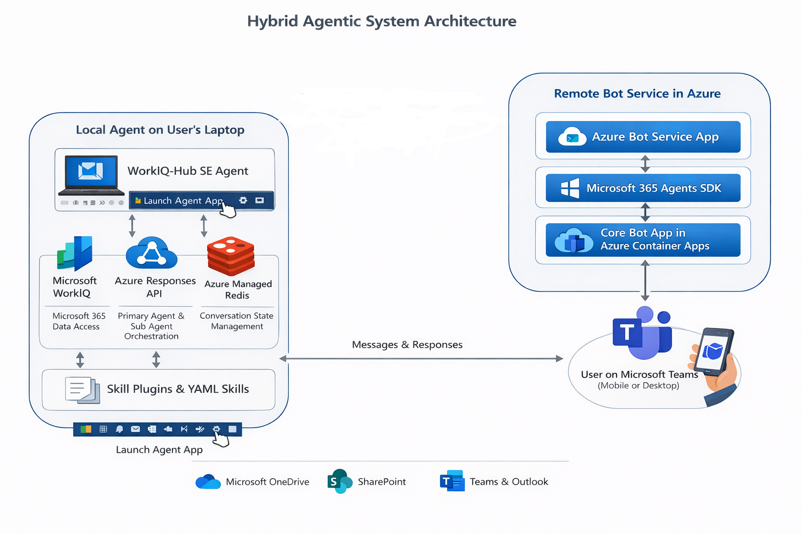

# Hub Cowork

**An always-on Windows desktop AI agent for Microsoft 365 engagement workflows.**

Hub Cowork runs quietly on a Hub Solution Engineer's laptop, orchestrating multi-step workflows against Microsoft 365 (calendars, email, SharePoint, contacts, OneDrive) via WorkIQ and Azure OpenAI. It is reachable three ways:

1. **Locally** — pywebview chat window summoned from the Windows system tray.
2. **Remotely from Microsoft Teams** — a companion cloud relay (see [workiq-agent-remote-client](https://github.com/sansri/workiq-agent-remote-client)) bridges Teams messages into the agent via Azure Managed Redis.
3. **Programmatically** — any client that can read/write the agent's Redis streams (a console test client is included).

Hub Cowork exhibits the design traits of emerging local‑agent platforms (Claude CoWork, OpenClaw): **always‑on local execution, skills‑driven autonomy, and remote reachability** — applied to Microsoft 365 workflows that remain painful to do manually (resolving speakers, cross‑referencing briefing notes with calendars, drafting agendas, sending batched invites, analysing RFPs).

---

## Functional Features

| Feature | Description |
|---|---|
| **Autonomous agentic execution** | State your intent in plain language. The agent orchestrates multi-step workflows end-to-end — deciding what data to fetch, what actions to take, and how to present the outcome — without further human input. |
| **Remote access via Microsoft Teams** | Send and receive messages from your phone through Teams. The agent processes work locally on your machine and delivers the result back through Azure Managed Redis. |
| **Multi-thread conversation model** | Every request is its own `ConversationThread` with an independent LLM context, executor, progress stream, and UI pane. Local and remote threads run in parallel — no cross-talk, no head-of-line blocking. |
| **Thread persistence & archive** | Threads are persisted to `~/.hub-cowork/threads/active/` and can be archived, unarchived, or deleted from the UI. Survives app restarts. |
| **Per-user Teams serialization** | At most one remote Teams task per user is "in flight" at a time. Follow-up replies to awaiting threads always go through; brand-new tasks that would stack are rejected politely with a pointer to the blocker thread. |
| **Three-way inbox classifier** | Incoming Teams messages are LLM-classified as `new` (start a thread), `existing` (continue a running thread, with `#thread-xxxx` tag as fast-path), or `system` (instant non-queued reply). |
| **Human-in-the-loop confirmation** | Skills can pause mid-flow with `[AWAITING_CONFIRMATION]`. The thread parks at status `awaiting_user`, persists state, and resumes on the user's next message (local click or Teams reply). |
| **Real-time status** | Ask "what's the status of my request?" any time — a non-queued system skill reports progress milestones without interrupting running work. |
| **Service connectivity indicators** | Header pills show live green/red/grey status for each backing service (WorkIQ CLI, FoundryIQ, Fabric Data Agent, Redis/Teams bridge). Updated passively from tool envelopes and refreshed by lightweight background probes. |
| **Skills-driven extensibility** | Each capability is a declarative YAML file. Add a new skill by dropping a YAML file into `src/hub_cowork/skills/` — no code changes. |
| **Settings UI with env editor** | Gear icon in the chat header opens a modal to edit hub config (speakers, agenda folder) and environment variables (endpoints, model names, Redis), then restart. |
| **Background operation** | Runs invisibly via `pythonw.exe` — no console window, no taskbar clutter until you summon it. |
| **System tray icon** | Pure Win32 (zero extra deps). Left-click to show/hide, right-click for context menu. |
| **Toast notifications** | Native Windows toasts on task start/complete. Click a toast to open the UI. |
| **Persistent authentication** | Sign in once; `InteractiveBrowserCredential` with persistent token cache refreshes silently across restarts. |
| **Auto-start at Windows login** | Install script registers the assistant to launch at startup. |

---

## Key Technical Capabilities

| Capability | Implementation |
|---|---|
| **Azure OpenAI Responses API** | The agentic core. Tool definitions + natural-language instructions drive autonomous tool-call orchestration. `previous_response_id` is **stored per ConversationThread** so each thread has an independent LLM context. |
| **Per-conversation executor pool** | `ExecutorPool` spawns one daemon thread per active conversation (`_ThreadWorker`); idle workers self-shut down. Each worker sets a `current_thread_id` ContextVar so logs get tagged correctly. |
| **Azure Managed Redis (cluster mode)** | Inbox/outbox streams keyed by user email. Passwordless Entra ID via `redis-entraid` credential provider with automatic token refresh. |
| **Namespaced Redis keys** | Every key is prefixed with `REDIS_NAMESPACE` (default `hub-cowork`) so this fork cannot collide with deployments sharing the same Redis instance. |
| **Composable tool system** | Tools are self-contained Python modules discovered at startup via `importlib`. Shared tools live in `src/hub_cowork/tools/`; skill-local tools live beside the skill under `skills/<group>/tools/`. |
| **Composable skill system** | Skills are YAML files discovered recursively from `src/hub_cowork/skills/**/*.yaml`. The router prompt is auto-generated from skill descriptions. Internal chained skills are excluded from routing. |
| **Shared credential architecture** | A single `InteractiveBrowserCredential` is shared across OpenAI, WorkIQ, ACS, and Redis — one sign-in, zero `az` CLI subprocesses on Windows. |

---

## The Two-Part Architecture



**Part 1** (this repo) is the agent itself — running on a Windows 11 laptop, processing tasks locally with full access to the user's Microsoft 365 data via WorkIQ. It registers its presence in Azure Managed Redis and polls an inbox stream for remote requests.

**Part 2** ([workiq-agent-remote-client](https://github.com/sansri/workiq-agent-remote-client)) is an **Azure Container App**, built on the **Microsoft 365 Agents SDK**, that fronts an **Azure Bot Service** channel for Microsoft Teams. The Bot Service hands inbound Teams messages to the container app; the container app writes them to the Redis inbox stream and reads outbox replies back. It extracts `#thread-xxxx` correlation tags from Teams replies and passes them as a fast-path hint so the agent knows which thread the message continues. The container app respects the `REDIS_NAMESPACE` env var so the same relay can point at different agent deployments.

The user experience: from a phone or laptop, the user opens **Microsoft Teams** → message hits the **Azure Bot Service** channel → forwarded to the **Azure Container App** (M365 Agents SDK) → published to **Azure Managed Redis** → the agent on the user's laptop picks it up, runs the full agentic workflow (retrieving M365 data, calling tools, orchestrating multi-step actions) → the result is written back through Redis → Container App → Bot Service → Teams chat. Because the local agent runs autonomously in the system tray, the user can fire off a workflow from Teams on the move, close the laptop lid (or leave the app minimised), and be notified asynchronously in Teams when the workflow completes.

---

## A Heterogeneous Agentic Solution

Hub Cowork bridges two clouds of the Microsoft AI stack, with the user's **Microsoft Entra** identity flowing on-behalf-of across both:

**Microsoft 365 cloud — the user's work intelligence**

- **WorkIQ** runs as a **CLI on the local computer** and is the backbone of the user's identity for everything that follows. Once the user signs in (interactive browser flow, persistent token cache), the same Entra credential is shared with Azure OpenAI, ACS, Redis, and every downstream tool — one sign-in, no `az` CLI subprocesses, no `DefaultAzureCredential` chain.
- Through WorkIQ, the agent reads the user's **calendars, emails, OneDrive, SharePoint, and contacts** with their own permissions.

**Azure cloud — reasoning, knowledge, and structured insight**

- **Azure OpenAI Responses API** — the autonomous reasoning core that orchestrates the multi-step agent loop via function calling.
- **FoundryIQ** — an **Agentic RAG** over **customer testimonials from past engagements**. The testimonial documents are uploaded to **Azure Blob Storage** and indexed into FoundryIQ, which the agent queries to surface relevant prior-customer voice when evaluating a new RFP.
- **FabricIQ / OneLake** — holds the **structured artefacts** from past projects (risks, costs, timelines, KPIs). A **Fabric Data Agent** is built on top of OneLake to expose this data through a natural-language interface.
- **Fabric Data Agent — direct call** — the local agent calls the Fabric Data Agent's **published OpenAI-compatible Assistants endpoint** (`/aiassistant/openai`) directly, with a Fabric-scoped Entra bearer token. An earlier design routed this through a Microsoft Foundry Agent that wrapped Fabric as a connected tool; that indirection added 10–15 minutes of latency and frequent timeouts, so it has been removed in favour of the direct call.

**Identity flow** — The user's Entra token issued at WorkIQ sign-in is propagated **on behalf of the user** to Azure OpenAI, FoundryIQ, the Fabric Data Agent, ACS, and Azure Managed Redis (via `redis-entraid`). Every call into both clouds runs with the user's own permissions; the agent never holds a shared service principal.

---

## Built-in Skills

Hub Cowork is **skills-driven** — each capability is a declarative YAML file rather than hardcoded logic.

| Skill | Model | Queued | What it does |
|---|---|---|---|
| **Meeting Invites** (`meeting_invites`) | full | yes | Autonomous workflow: retrieve agenda → filter speakers → resolve emails → send calendar invites via ACS |
| **Engagement Briefing** (`engagement_briefing`) | full | yes | Phase 1 of the agenda pipeline: locate briefing calls, **confirm selection with user** (HITL), retrieve notes, extract metadata. Auto-chains → Goals |
| **Engagement Goals** (`engagement_goals`) | full | yes | Phase 2: extract and segment customer goals from briefing notes. Auto-chains → Agenda Build |
| **Engagement Agenda Build** (`engagement_agenda_build`) | full | yes | Phase 3: build a detailed agenda markdown table with time slots, speakers, descriptions. Auto-chains → Publish |
| **Engagement Agenda Publish** (`engagement_agenda_publish`) | full | yes | Phase 4: create a Word document from the agenda and save to the configured output folder (OneDrive-synced) |
| **Agenda Repurpose** (`agenda_repurpose`) | full | yes | Conversational: retrieve an existing agenda, collect new customer details (name, date, venue), produce a repurposed Word document |
| **RFP Evaluation** (`rfp_evaluation`) | full | yes | Retrieve an RFP via WorkIQ, consult FoundryIQ + Fabric Data Agent, synthesise a Bid Intelligence Brief, save to OneDrive, share with the team |
| **Q&A** (`qa`) | mini | yes | Conversational Q&A about M365 data with per-thread history |
| **Task Status** (`task_status`) | mini | no | Report current thread progress and active-thread count — responds instantly even while a task is running |
| *(Router direct)* | mini | no | Greetings and small talk — handled by the router (`"none"` classification) without invoking a skill |

**Queued** refers to per-thread serialization: a queued skill runs on its conversation's own executor thread (so it doesn't block other conversations); a non-queued skill runs immediately on the SYSTEM pseudo-thread.

### Engagement Agenda Workflow — Autonomous 4-Phase Skill Chain

```
  User: "create an agenda for Contoso"
    │
    ▼
  Phase 1: engagement_briefing  (conversational, HITL)
    │  Turn 1: Find briefing calls → present → [AWAITING_CONFIRMATION]
    │          ↳ thread status → awaiting_user, executor idles, state persisted
    │  Turn 2+: User confirms/corrects  (can arrive locally OR via Teams reply)
    │           Retrieve notes → extract metadata
    │  next_skill: engagement_goals
    ▼
  Phase 2: engagement_goals
    │  Extract & segment customer goals from notes
    │  next_skill: engagement_agenda_build
    ▼
  Phase 3: engagement_agenda_build
    │  Load goals + hub config → build agenda table
    │  Map goals to sessions, assign speakers, compute time slots
    │  next_skill: engagement_agenda_publish
    ▼
  Phase 4: engagement_agenda_publish
    │  Create Word doc via python-docx, save to agenda_output_folder
    ▼
  Complete agenda displayed in UI + .docx on disk
```

**Skill chaining** — Driven by the `next_skill` field in each YAML. On normal completion, `agent_core` invokes the next phase with the completion text as input. Control flow markers in the final text alter this:

| Marker | Effect |
|---|---|
| *(none)* | Chain to `next_skill` if configured |
| `[STOP_CHAIN]` | Halt chaining, clear thread's active session, return text as-is (used to gate on errors — e.g., no briefing calls found) |
| `[AWAITING_CONFIRMATION]` | Pause for user input. Thread status → `awaiting_user`, marker stripped, no chaining. Next message to the same thread resumes the skill. |

**Active session lives on the ConversationThread** (`thread.active_session`), not a global — so multiple parallel threads can each be awaiting confirmation on different skills without interfering.

**Inter-phase context** — Passed via the `engagement_context` tool, which reads/writes JSON under `~/.hub-cowork/engagement_context/<customer>.json`. Each phase appends its output (metadata, goals, agenda) to the shared file.

**Hub configuration** — Phase 3 reads default session start time and speaker-by-topic mapping via `get_hub_config`. Users edit these in the ⚙ Settings UI.

**Engagement type detection** — Phase 1 classifies as `ADS`, `RAPID_PROTOTYPE`, `BUSINESS_ENVISIONING`, `SOLUTION_ENVISIONING`, `HACKATHON`, or `CONSULT`. Phase 3 applies type-specific agenda patterns.

---

## Classifier, Gate, and HITL Correlation

Three mechanisms keep multi-thread remote traffic predictable.

**1. Inbox classifier** (`agent_core.classify_inbox`)

Every inbound Teams message is classified as `new`, `existing`, or `system`. The classifier receives a summary of every active thread, including both `last_user_excerpt` (120 chars) and `last_agent_excerpt` (240 chars). Strong signals bias toward `existing` when:

- The user is replying to a question that listed multiple fields (e.g., "Customer is Texmaco, date 21 Apr, venue Teams virtual")
- The user is replying to numbered options or a yes/no confirmation
- Exactly one thread is `awaiting_user` (tie-breaker)

Fast-path: if the Teams relay supplies a `thread_id` hint (extracted from the `#thread-xxxx` tag the agent prefixes to every outbound reply), the classifier verdict for that thread is honored without an LLM call.

**2. Per-Teams-user gate** (`host/redis_bridge.py`)

For any inbound message classified as `new`, the bridge checks whether the same Teams user already has an in-flight thread (`running` or `awaiting_user`, `source=="remote"`). If so, the new thread is rejected with an outbox message tagged to the blocking thread's correlation, asking the user to finish or cancel the active task first. `existing` and `system` classifications bypass the gate entirely — so HITL replies and status checks are never blocked.

**3. `#thread-xxxx` correlation tags**

Every outbound Teams reply is prefixed with the thread's `hitl_correlation_tag` (e.g., `#thread-ab12cd`). Users can keep this tag in their Teams reply to deterministically route follow-ups to the same thread. The Teams relay strips the tag from the user-visible text and forwards it as a structured hint.

---

## Adding Skills and Tools

### New tool

Create `src/hub_cowork/tools/<name>.py` (shared) or `src/hub_cowork/skills/<group>/tools/<name>.py` (skill-local) exporting:

```python
SCHEMA: dict = {
    "type": "function",
    "name": "my_tool",
    "description": "...",
    "parameters": { ... },  # JSON Schema
}

def handle(arguments: dict, *, on_progress=None, workiq_cli=None, **kwargs) -> str:
    ...
```

Files starting with `_` are skipped. Restart to pick up a new tool.

### New skill

Create `src/hub_cowork/skills/<name>.yaml` (standalone) or `src/hub_cowork/skills/<group>/<name>.yaml` (grouped chain) with these fields:

| Field | Required | Type | Description |
|---|---|---|---|
| `name` | ✓ | `string` | Unique identifier — what the router emits when it classifies a request |
| `description` | ✓ | `string` | Natural-language description used by the router. Prefix with `[INTERNAL` to exclude from routing (chain-only) |
| `model` | ✓ | `"full"` \| `"mini"` | `full` → complex reasoning; `mini` → faster/cheaper |
| `conversational` | ✓ | `bool` | `true` → retains per-thread history; required for HITL |
| `queued` | ✓ | `bool` | `true` → runs on the conversation's executor thread; `false` → runs on SYSTEM pseudo-thread immediately |
| `tools` | ✓ | `list[string]` | Tool names this skill can call |
| `instructions` | ✓ | `string` | System prompt |
| `next_skill` | — | `string` | Name of skill to chain to on normal completion |

YAML-only edits (instructions, etc.) are picked up without restart. New files require a restart.

Greetings and small talk are handled directly by the router (classified as `"none"`) without invoking any skill.

---

## Hub Configuration & Settings UI

There are **two distinct stores** of settings, used for different purposes:

### 1. Hub config (JSON) — application data

Things the agent reads as structured data via the `get_hub_config` tool: hub name, default session start time, topic catalog, agenda output folder, agenda template path, etc.

```
src/hub_cowork/assets/hub_config.default.json    ← Shipped defaults (in the wheel)
~/.hub-cowork/hub_config.json                    ← User overrides (created on first Save)

hub_config.load() returns:  defaults  ⊕  user overrides   (user wins per-key)
```

### 2. Environment variables — endpoints, model names, secrets

Things the code reads as `os.environ["..."]` at startup: Azure OpenAI endpoint, model deployment names, ACS endpoint, Redis endpoint, FoundryIQ search endpoint, Fabric Data Agent URL, RFP output folder, RFP share recipients, Graph credentials, etc.

These come from **three layers**, applied in this precedence (highest first):

| # | Source | Where it lives | When it wins |
|---|---|---|---|
| 1 | `_env_overrides` (Settings UI) | `~/.hub-cowork/hub_config.json` under the `_env_overrides` key | Always wins if the value is a non-empty string |
| 2 | User `.env` file | The current working directory when you launch the app | Wins over packaged defaults if layer 1 didn't set the key |
| 3 | Packaged `.env.defaults` | `src/hub_cowork/assets/.env.defaults` (shipped in the wheel) | Last-resort fallback so the app boots even with no user setup |

**How it's wired** (see [`src/hub_cowork/__main__.py`](src/hub_cowork/__main__.py)):

```python
_apply_env_overrides()   # 1. Promote _env_overrides into os.environ
_load_env_files()        # 2. load_dotenv(.env, override=False)
                         # 3. load_dotenv(assets/.env.defaults, override=False)
```

`override=False` is the key — once a value is in `os.environ` it cannot be downgraded by a lower-precedence source.

### What goes where?

| Setting | Where | Read by |
|---|---|---|
| `hub_name`, `topic_catalog`, `default_session_start_time`, `agenda_output_folder`, `agenda_template_path` | Hub config (top level of `hub_config.json`) | Skills, via `get_hub_config` tool |
| `AZURE_OPENAI_*`, `ACS_*`, `AZURE_TENANT_ID`, `AZ_REDIS_CACHE_ENDPOINT`, `REDIS_*`, `FOUNDRYIQ_*`, `FABRIC_*`, `RESOURCE_TENANT_ID`, `GRAPH_*`, `RFP_OUTPUT_FOLDER`, `RFP_SHARE_RECIPIENTS`, `WORKIQ_PATH` | Env vars (any of the 3 layers above) | Anywhere via `os.environ`, plus `get_hub_config` (see consistency note) |

### One consistent read path (consistency note)

All callers — Python modules and skills alike — see env-var values from the same merged view, regardless of which layer set them:

- **Python code** (e.g. `agent_core.py`, `redis_bridge.py`, `create_rfp_brief_doc.py`) reads `os.environ["FOO"]`. Because `__main__.py` promotes `_env_overrides` into `os.environ` *before* importing the agent host, every layer is visible through this one syscall.
- **Skill instructions** that need a value through the LLM call the `get_hub_config` tool. That tool flattens any non-empty `_env_overrides` entries on top of the hub-config JSON before returning, so the LLM sees the same effective value the Python code does.

**Net result:** there is exactly **one source of truth per env var**, computed at boot, regardless of whether the value originated in the Settings UI, a local `.env`, or the packaged defaults. No skill or module has its own fallback chain.

### Settings UI

The ⚙ gear icon in the chat header opens a modal with two sections:

- **Hub settings** — top-level keys in `hub_config.json` (hub name, default session start time, speakers by topic, agenda output folder, agenda template path).
- **Environment variables** — the env editor. Every value typed here is saved to the `_env_overrides` map in `~/.hub-cowork/hub_config.json` and applied to `os.environ` on the next launch (the UI offers a one-click restart).

After changing env values you need to restart so module-level reads (e.g. `ENDPOINT = os.environ[...]`) pick up the new values. Hub-config edits are picked up live by the next `get_hub_config` call.

---

## Architecture

```
┌───────────────────────────────────────────────────────────────────────────────┐
│                              Windows 11 Desktop                               │
│                                                                               │
│  ┌──────────────────────┐     ┌───────────────────────────────────────────┐   │
│  │  pywebview window    │◄───►│   WebSocket server  (ws://127.0.0.1:18080)│   │
│  │  (chat_ui.html)      │     │   HTTP server       (http://127.0.0.1:18081)  │
│  │                      │     │                                           │   │
│  │ • Thread list pane   │     │  ┌─────────────┐   ┌────────────────────┐ │   │
│  │ • Chat pane          │     │  │ Tool loader │   │  Skill loader      │ │   │
│  │ • Progress/Logs pane │     │  │ tools/*.py  │   │  skills/**/*.yaml  │ │   │
│  │ • Settings + env UI  │     │  └──────┬──────┘   └──────────┬─────────┘ │   │
│  │ • Auth banner        │     │         │                     │           │   │
│  └──────────────────────┘     │  ┌──────▼─────────────────────▼────────┐  │   │
│                               │  │       Router (master agent)         │  │   │
│  ┌────────────────────┐       │  │  — classifies local requests into   │  │   │
│  │ System tray icon   │       │  │    skill | "none" (greeting)        │  │   │
│  │ (Win32 ctypes)     │       │  └─────────────────┬───────────────────┘  │   │
│  └────────────────────┘       │                    │                      │   │
│                               │              ┌─────▼─────────┐            │   │
│  ┌─────────────────────┐      │              │ ThreadManager │            │   │
│  │ Toast notifications │      │              │   observers,  │            │   │
│  │ (winotify)          │      │              │  ContextVar   │            │   │
│  └─────────────────────┘      │              └─────┬─────────┘            │   │
│                               │                    │                      │   │
│                               │           ┌────────▼─────────────────────┐│   │
│                               │           │   ExecutorPool               ││   │
│                               │           │  one _ThreadWorker per       ││   │
│                               │           │  active conversation; idle-  ││   │
│                               │           │  shutdown; tags logs via     ││   │
│                               │           │  current_thread_id CV        ││   │
│                               │           └────────┬─────────────────────┘│   │
│                               │                    │                      │   │
│                               │   ┌────────────────▼──────────────────┐   │   │
│                               │   │   Skill sub-agent execution       │   │   │
│                               │   │   Azure OpenAI Responses API      │   │   │
│                               │   │   — per-thread previous_response_id│  │   │
│                               │   │   — autonomous tool-call loop     │   │   │
│                               │   └─────────┬─────────┬───────────────┘   │   │
│                               │             │         │                   │   │
│                               │   ┌─────────▼─┐   ┌───▼──────────────┐    │   │
│                               │   │ Tool layer│   │ Progress stream  │    │   │
│                               │   │ ...       │   │ → UI (WS)        │    │   │
│                               │   │           │   │ → Toast          │    │   │
│                               │   │           │   │ → thread.progress│    │   │
│                               │   └─────────┬─┘   │ → Redis outbox   │    │   │
│                               │             │     └──────────────────┘    │   │
│                               │   ┌─────────▼─────────────────────────┐   │   │
│                               │   │    LocalJsonThreadStore           │   │   │
│                               │   │   ~/.hub-cowork/threads/          │   │   │
│                               │   │       active/   archive/          │   │   │
│                               │   └───────────────────────────────────┘   │   │
│                               └───────────────┬───────────────────────────┘   │
│                                               │                               │
│  ┌────────────────────────────────────────────▼─────────────────────────────┐ │
│  │                      Redis bridge (optional)                             │ │
│  │  • Polls {ns}:inbox:{email} via XREAD (blocking)                         │ │
│  │  • classify_inbox → new | existing | system                              │ │
│  │  • Per-user single-in-flight gate on "new"                               │ │
│  │  • Writes {ns}:outbox:{email} with in_reply_to + #thread-xxxx prefix     │ │
│  │  • {ns}:agents:{email} presence with TTL heartbeat                       │ │
│  │  • redis-entraid credential provider, shared InteractiveBrowserCredential│ │
│  └───────────────────────┬──────────────────────────────────────────────────┘ │
└──────────────────────────┼────────────────────────────────────────────────────┘
                           │
          ┌────────────────▼──────────────────┐
          │  Azure Managed Redis (cluster)    │
          │  streams keyed by user email      │
          └────────────────┬──────────────────┘
                           │
          ┌────────────────▼──────────────────┐
          │  Part 2: workiq-agent-remote-     │
          │          client (Teams relay)     │
          │  — REDIS_NAMESPACE-aware          │
          │  — extracts #thread-xxxx          │
          └───────────────────────────────────┘

          ┌───────────────────────────────────┐
          │  WorkIQ CLI → M365 Graph          │
          │  (Calendar / Email / Files /      │
          │   Contacts / SharePoint)          │
          └───────────────────────────────────┘

          ┌───────────────────────────────────┐
          │  Azure Communication Services     │
          │  (calendar invite email)          │
          └───────────────────────────────────┘

          ┌───────────────────────────────────┐
          │  RFP skill only (cross-tenant):   │
          │   FoundryIQ · Fabric Data Agent   │
          └───────────────────────────────────┘
```

### How it all fits together

1. **Single-process launcher** (`python -m hub_cowork` → `hub_cowork/__main__.py` → `host/desktop_host.py::main`) — applies `_env_overrides` from the Settings UI, loads `.env` and packaged `.env.defaults`, starts the WebSocket/HTTP servers, system tray, optional Redis bridge, shows a startup toast, and enters the pywebview event loop.

2. **WebSocket server (port 18080)** — JSON protocol, typed messages for threads, progress, logs, config, and remote-message notifications. See [WebSocket protocol](#websocket-protocol) below.

3. **HTTP server (port 18081)** — Handles toast notification clicks: `GET /show` brings up the pywebview window.

4. **Three-pane pywebview UI** — Thread list (active + archived), chat, and a details/progress/logs pane per thread. Each thread has its own progress stream and code log.

5. **Tool loader** — Imports all shared `*.py` in `src/hub_cowork/tools/` and all skill-local `skills/*/tools/*.py` at startup.

6. **Skill loader** — Walks `src/hub_cowork/skills/**/*.yaml` and builds the router prompt from non-`[INTERNAL` descriptions.

7. **Router (master agent)** — Classifies local requests. `"none"` → answered directly; otherwise → skill selection.

8. **ThreadManager** — Thread-safe singleton. Stores `ConversationThread` objects in memory, exposes observer hooks, and owns the `current_thread_id` ContextVar and the `SYSTEM_THREAD_ID` constant.

9. **ExecutorPool** — One daemon `_ThreadWorker` per active conversation. Each worker sets `current_thread_id` before dispatching, calls `agent_core.run_agent_on_thread(...)`, emits progress, and calls `on_thread_reply` for Redis outbox delivery. Workers shut down after a configurable idle period.

10. **Skill sub-agents** — Azure OpenAI Responses API. Tool definitions + instructions drive the autonomous tool-call loop. `previous_response_id` is stored on the `ConversationThread` so every thread has its own LLM context.

11. **Tool execution layer** — `query_workiq`, `log_progress`, `get_task_status`, `get_hub_config`, `create_word_doc`, `resolve_speakers`, `send_email` are shared; `engagement_context` (agenda chain), `create_meeting_invites` (meeting invites), and `create_rfp_brief_doc` / `query_fabric_agent` / `search_foundryiq` / `share_onedrive_document` (RFP) are skill-local.

12. **LocalJsonThreadStore** — Debounced atomic JSON writes under `~/.hub-cowork/threads/{active,archive}/`. A `ThreadArchiveStore` Protocol is reserved for a future Cosmos DB backend.

13. **Redis bridge** (optional) — Inbox poller, 3-way classifier, per-user gate, outbox writer with `in_reply_to` + `#thread-xxxx` correlation, presence key with TTL heartbeat. Shares the agent's credential — no `DefaultAzureCredential` chain and no `az` CLI subprocesses under `pythonw.exe`.

---

## Project Structure

```
hub-cowork/
├── pyproject.toml               # Package definition, dependencies, console + gui scripts
├── requirements.txt             # Pin list for editable dev installs
├── README.md                    # You are here
├── .env.example                 # Starter environment file
├── favicon.svg
│
├── src/hub_cowork/
│   ├── __init__.py
│   ├── __main__.py              # `python -m hub_cowork` entry — applies env overrides
│   │
│   ├── core/                    # Pure logic, no I/O wiring
│   │   ├── agent_core.py            # Router, classifier, skill/tool loaders, run_agent_on_thread / run_skill_on_thread, shared credential
│   │   ├── conversation_thread.py   # ConversationThread dataclass (id, status, messages, progress_log, code_log, previous_response_id, active_session, hitl_correlation_tag, source, external_user)
│   │   ├── thread_manager.py        # Registry singleton, observer pattern, current_thread_id ContextVar, SYSTEM_THREAD_ID
│   │   ├── thread_executor.py       # ExecutorPool + _ThreadWorker (per-thread daemon, idle shutdown, thread_id tagging, on_thread_reply)
│   │   ├── thread_store.py          # LocalJsonThreadStore (debounced atomic writes); ThreadArchiveStore Protocol
│   │   ├── hub_config.py            # Config loader — merges shipped defaults with ~/.hub-cowork/hub_config.json
│   │   ├── app_paths.py             # Central app-home + branding constants ("Hub Cowork", ~/.hub-cowork/)
│   │   ├── service_status.py        # Per-service connectivity monitor (passive envelope tracking + background probes)
│   │   └── outlook_helper.py        # ACS email + .ics invite builder
│   │
│   ├── host/                    # Runtime hosts (UI, console, remote bridge, tray)
│   │   ├── desktop_host.py         # WS+HTTP servers, pywebview UI, tray wire-up, ExecutorPool + Redis wiring
│   │   ├── console.py               # Terminal REPL — no UI, no background mode (hub-cowork-console script)
│   │   ├── redis_bridge.py          # Redis inbox poller, classifier, per-user gate, outbox writer, presence
│   │   ├── tray_icon.py             # Pure Win32 tray via ctypes (own message pump thread)
│   │   └── ui_actions.py            # Shared WS/UI action handlers (sign-in, config save, restart)
│   │
│   ├── tools/                   # Shared tools (auto-discovered)
│   │   ├── query_workiq.py
│   │   ├── log_progress.py
│   │   ├── get_task_status.py
│   │   ├── get_hub_config.py
│   │   ├── create_word_doc.py
│   │   ├── resolve_speakers.py
│   │   └── send_email.py
│   │
│   ├── skills/                  # YAML skills + optional skill-local tools
│   │   ├── qa.yaml
│   │   ├── task_status.yaml
│   │   ├── agenda_repurpose.yaml
│   │   ├── hub_agenda_creation/
│   │   │   ├── engagement_briefing.yaml     # Phase 1 (HITL)
│   │   │   ├── engagement_goals.yaml        # Phase 2
│   │   │   ├── engagement_agenda_build.yaml # Phase 3
│   │   │   ├── engagement_agenda_publish.yaml # Phase 4
│   │   │   └── tools/engagement_context.py
│   │   ├── meeting_invites/
│   │   │   ├── meeting_invites.yaml
│   │   │   └── tools/create_meeting_invites.py
│   │   └── rfp_evaluation/
│   │       ├── rfp_evaluation.yaml
│   │       └── tools/
│   │           ├── create_rfp_brief_doc.py
│   │           ├── query_fabric_agent.py
│   │           ├── search_foundryiq.py
│   │           └── share_onedrive_document.py
│   │
│   └── assets/                  # Shipped inside the wheel
│       ├── .env.defaults            # Lowest-precedence env defaults
│       ├── chat_ui.html             # Three-pane chat UI markup
│       ├── chat_ui.css              # UI styles
│       ├── chat_ui.js               # UI state, WebSocket client, renderers
│       ├── hub_config.default.json  # Default hub settings
│       ├── agent_icon.png
│       └── agent_icon.ico
│
├── scripts/
│   ├── start.ps1                # Launch detached via pythonw
│   ├── stop.ps1                 # Kill running instance(s)
│   ├── restart.ps1              # Stop + start
│   └── autostart.ps1            # Install/uninstall Windows login auto-start
│
├── test-client/                 # Console REPL test client (simulates a Teams relay)
│   ├── chat.py
│   └── requirements.txt
│
└── docs/
    └── architecture.png         # Solution architecture diagram
```

---

## Getting Started

### Prerequisites

- **Windows 11** (Mac support exists but is untested)
- **Python 3.12+**
- **WorkIQ CLI** installed and on `PATH` (or `WORKIQ_PATH` set in `.env`)
- **Azure OpenAI** resource with a full model (e.g., `gpt-5.2`) and a mini model (e.g., `gpt-5.4-mini`) deployed
- **Azure Communication Services** resource (for meeting invites)
- **Azure Managed Redis** (optional) — enables Teams remote access. Entra ID auth only (no API keys).

### Installation

```powershell
# Clone
git clone <repo-url>
cd hub-cowork

# Virtual env
python -m venv .venv
.\.venv\Scripts\Activate.ps1

# Install (editable, so edits to src/ take effect immediately)
pip install -e .

# Or: pin-for-pin install
# pip install -r requirements.txt
# $env:PYTHONPATH = "$PWD\src"

# Configure
copy .env.example .env
# Edit .env with Azure endpoints, model names, tenant id, ACS, and (optional) Redis.
```

### Running

```powershell
# Headless production (no console window)
.\scripts\start.ps1

# Force-restart
.\scripts\restart.ps1

# Stop
.\scripts\stop.ps1

# Debug with console output
python -m hub_cowork

# Console REPL (no UI, no Redis bridge)
hub-cowork-console     # or: python -m hub_cowork.host.console
```

When installed via `pip install -e .`, two console scripts are registered (see `pyproject.toml`):

- `hub-cowork` — GUI launcher (no console window, equivalent to `pythonw -m hub_cowork`)
- `hub-cowork-console` — terminal REPL

### Auto-start at Windows login

```powershell
.\scripts\autostart.ps1 install     # creates a VBScript launcher in the Startup folder
.\scripts\autostart.ps1 uninstall
```

---

## Testing Remote Task Delivery

The `test-client/` folder contains a console REPL that simulates a remote sender by reading/writing the same Redis streams the Teams relay uses.

### Prerequisites

- Agent is running (`.\scripts\start.ps1`)
- `AZ_REDIS_CACHE_ENDPOINT` set in `.env`
- The test client reuses the agent's saved auth record at `~/.hub-cowork/auth_record.json`

### Running

```powershell
.\.venv\Scripts\Activate.ps1
python test-client\chat.py
```

On startup the client authenticates, connects to Redis using the **same `REDIS_NAMESPACE`** as the agent, reads the presence key `{ns}:agents:{email}` to confirm the agent is online, then prompts `You >`.

### What to test

| Test | What happens |
|---|---|
| Type `hello` | Classifier → `system` → router handles as small talk → purple "remote" bubble in the UI + reply in the test client |
| Type a business query | Classifier → `new` → gate check → new thread created → skill runs → outbox reply arrives with `#thread-xxxx` prefix |
| Type another business query immediately | Gate rejects: "You already have a task in progress — reply in that thread or wait for it to finish" |
| Reply to an `awaiting_user` thread (keep the `#thread-xxxx` tag) | Classifier fast-path via `thread_id` hint → `existing` → resumes the paused skill |
| Ask `what's the status?` from the local UI while a remote task runs | Non-queued `task_status` skill reports live progress without interrupting |

---

## WebSocket Protocol

All messages are JSON with a `type` field. The UI and backend share the same protocol.

**Client → server:** `create_thread`, `send_to_thread`, `list_threads`, `get_thread`, `archive_thread`, `unarchive_thread`, `list_archived_threads`, `delete_thread`, `system_query`, `signin`, `clear_history`, `get_logs`, `get_config`, `save_config`, `restart`.

**Server → client:** `threads_list`, `thread_created`, `thread_updated`, `thread_detail`, `thread_started`, `thread_progress`, `thread_completed`, `thread_error`, `thread_archived`, `thread_unarchived`, `thread_deleted`, `log_entry`, `log_history`, `system_query_*`, `auth_status`, `signin_status`, `skills_list`, `service_status`, `config_data`, `config_saved`, `restart_ack`, `remote_message`.

Every invocation carries a `request_id` (`uuid.uuid4().hex[:8]`) used for correlation across WebSocket, UI, Redis outbox, and log entries.

### Redis streams schema

| Key | Direction | Fields |
|---|---|---|
| `{ns}:inbox:{email}`   | Remote → Agent | `sender`, `text`, `ts`, `msg_id`, optional `thread_id` hint |
| `{ns}:outbox:{email}`  | Agent → Remote | `task_id`, `status`, `text` (prefixed with `#thread-xxxx`), `ts`, `in_reply_to` |
| `{ns}:agents:{email}`  | Agent → Cloud  | JSON: `{name, email, started_at, version}` with TTL refreshed every 30 min |

`{ns}` is `REDIS_NAMESPACE` (default: `hub-cowork`).

---

## Configuration

Set in `.env` at the repo root, or in `src/hub_cowork/assets/.env.defaults` for shipped defaults, or via the Settings UI (which writes `_env_overrides` into `~/.hub-cowork/hub_config.json`).

| Variable | Description |
|---|---|
| `AZURE_OPENAI_ENDPOINT` | Azure OpenAI resource endpoint |
| `AZURE_OPENAI_CHAT_MODEL` | Full model (e.g., `gpt-5.2`) |
| `AZURE_OPENAI_CHAT_MODEL_SMALL` | Mini model (e.g., `gpt-5.4-mini`) |
| `AZURE_OPENAI_API_VERSION` | e.g., `2025-03-01-preview` |
| `AZURE_TENANT_ID` | Azure AD tenant ID |
| `AZURE_SUBSCRIPTION_ID` | (optional) Azure subscription ID |
| `ACS_ENDPOINT` | Azure Communication Services endpoint |
| `ACS_SENDER_ADDRESS` | Verified sender for ACS email |
| `AZ_REDIS_CACHE_ENDPOINT` | (optional) `host:port` — enables remote delivery |
| `REDIS_NAMESPACE` | (optional, default `hub-cowork`) — key prefix |
| `REDIS_SESSION_TTL_SECONDS` | (optional, default `86400`) — presence key TTL |
| `AGENT_TIMEZONE` | (optional) IANA override; auto-detected otherwise |
| `WORKIQ_PATH` | (optional) Full path to WorkIQ CLI |
| `FOUNDRYIQ_ENDPOINT`, `FOUNDRYIQ_KB_NAME`, `FOUNDRYIQ_AUTH_MODE`, `FOUNDRYIQ_API_VERSION` | RFP skill only — Azure AI Search knowledge store |
| `FABRIC_DATA_AGENT_URL`, `FABRIC_AUTH_MODE` | RFP skill only — Fabric Data Agent (direct call) |
| `RESOURCE_TENANT_ID` | RFP skill only — cross-tenant guest subscription |
| `RFP_OUTPUT_FOLDER`, `RFP_SHARE_RECIPIENTS` | RFP skill — OneDrive output + share list |
| `GRAPH_*` | (optional) Microsoft Graph app creds for document sharing; falls back to WorkIQ |

**Redis is optional.** Without `AZ_REDIS_CACHE_ENDPOINT`, the agent runs local-only — all features work except Teams remote access.

---

## Authentication

Hub Cowork uses **a single shared `InteractiveBrowserCredential`** (constructed in `core/agent_core.py`) for **every** outbound Azure call — Azure OpenAI, FoundryIQ (Azure AI Search), Fabric Data Agent, ACS email, WorkIQ helpers, and the Redis bridge. There is no `DefaultAzureCredential` chain and no `az` CLI subprocess (the agent runs under `pythonw.exe` where `az` would have nowhere to print device codes).

### One credential, one auth record, one disk cache

```python
# src/hub_cowork/core/agent_core.py
_cache_options = TokenCachePersistenceOptions(name="hub_cowork")          # persistent MSAL cache
_AUTH_RECORD_PATH = APP_HOME / "auth_record.json"                          # ~/.hub-cowork/auth_record.json

_auth_record = AuthenticationRecord.deserialize(_AUTH_RECORD_PATH.read_text())  # if file exists
_credential  = InteractiveBrowserCredential(
    tenant_id=AZURE_TENANT_ID,
    cache_persistence_options=_cache_options,
    authentication_record=_auth_record,    # ← key: links the cache entries to a known user
)
set_credential(_credential)                # exposed via get_credential() to all consumers
```

The two pieces work together:

- **`TokenCachePersistenceOptions(name="hub_cowork")`** — tells MSAL to back the in-memory token cache with a disk file under Windows Credential Manager (DPAPI-encrypted on Windows; libsecret/Keychain on Linux/macOS). Caches both **access tokens** (typ. ~1 hr lifetime, scope-specific) and the **refresh token** (typ. ~90 days, rolling).
- **`AuthenticationRecord`** — a small JSON blob (`home_account_id`, `username`, `tenant_id`, `authority`, `client_id`) that tells MSAL *which* identity owns the cached entries. **Without it, even a populated cache is unusable** — MSAL has no way to map a `get_token()` request to a stored refresh token, so it falls back to interactive login.

### Sign-in flow

```
First launch
└─ no auth_record.json yet
   └─ check_azure_auth() returns (False, "Not signed in")
   └─ UI shows the "Sign in to Azure" button
   └─ user clicks → run_az_login()
      ├─ _credential.authenticate(scopes=["…cognitiveservices…/.default"])
      │     └─ opens system browser, completes Entra ID OAuth
      ├─ saves AuthenticationRecord to ~/.hub-cowork/auth_record.json
      └─ rebuilds _credential with the saved record (so the running session starts using silent refresh immediately)

Subsequent launches
└─ auth_record.json found
   └─ deserialize, build credential with record
   └─ check_azure_auth() calls _credential.get_token(...) silently
      └─ MSAL: cache hit on access token (within lifetime) → return immediately
                cache miss → use refresh token to mint new access token (silent)
                refresh token expired/revoked → raise → UI shows "Sign in" again
```

### Token refresh paths

There are four token consumers, all sharing the one credential:

| Consumer | Where it lives | Refresh logic |
|---|---|---|
| **Azure OpenAI** (Responses API) | `agent_core.get_responses_client()` | Caches OpenAI client + `expires_on`; on every call checks `now < expires_on - 300` (5-min skew buffer). On expiry, calls `_credential.get_token(...)` again — MSAL silently mints a new access token from the cached refresh token. If silent refresh raises, falls back to `run_az_login()` (interactive, last resort). The refresh path is guarded by `_responses_client_lock` so concurrent thread executors don't race. |
| **FoundryIQ search** | `skills/rfp_evaluation/tools/search_foundryiq.py::_get_credential` | Reuses the shared credential via `agent_core.get_credential()`. Per-tool token cache (`_cached_token`) refreshes when `expires_on < now + 60`. Because the shared credential has the AuthRecord, `get_token("https://search.azure.com/.default")` is silent — no second browser prompt for the new resource scope. |
| **Fabric Data Agent** | `skills/rfp_evaluation/tools/query_fabric_agent.py::_get_credential` | Same pattern as FoundryIQ. Refreshes when `expires_on - now < _TOKEN_REFRESH_BUFFER_SECONDS` (60s). Silent for `https://api.fabric.microsoft.com/.default`. |
| **Redis bridge** (Azure Managed Redis) | `host/redis_bridge.py` | Wraps the shared credential in `redis-entraid`'s `EntraIdCredentialsProvider`, which handles connection-level reauth and access-token rotation transparently. |

### Why "no popup until 90+ days idle"

- **Access tokens** (~1 hr) are refreshed silently from the **refresh token** in the persistent cache. The user never sees this.
- **Refresh tokens** (~90 days) are themselves rolled forward on every successful use. So as long as you use the app at least once every ~90 days, your refresh token never expires.
- **Multiple resource scopes** (Cognitive Services, Azure Search, Fabric, ARM, etc.) are all minted from the same refresh token via MSAL's `acquire_token_silent` — first request to a new scope triggers a silent token call, not an interactive prompt.

### Where the bytes actually live

There are two on-disk artefacts. They are deliberately separate.

**1. `~/.hub-cowork/auth_record.json`** (written by Hub Cowork, plain JSON, ~1 KB, no secrets)

Created in `run_az_login()` after a successful interactive sign-in:

```python
record = _credential.authenticate(scopes=["https://cognitiveservices.azure.com/.default"])
_AUTH_RECORD_PATH.write_text(record.serialize())   # JSON dump of AuthenticationRecord
```

Contents are:

```json
{
  "authority": "login.microsoftonline.com",
  "client_id": "<azure-identity's default public client>",
  "home_account_id": "<oid>.<tenant_id>",
  "tenant_id": "<tenant_id>",
  "username": "user@contoso.com",
  "version": "1.0"
}
```

This is **not** a token. It is a pointer that says *"the refresh token belonging to this user is somewhere in the MSAL cache — go find it."* On next process start, the deserialised record is passed to `InteractiveBrowserCredential(authentication_record=...)`, which lets MSAL look up the matching refresh-token entry by `home_account_id`.

**2. The MSAL persistent token cache** (written by `azure-identity[persistent-cache]` via the `msal_extensions` library, encrypted by the OS keystore)

| Platform | Backend | Where |
|---|---|---|
| **Windows** | DPAPI-encrypted file | `%LOCALAPPDATA%\.IdentityService\hub_cowork.cache` (the file name comes from `TokenCachePersistenceOptions(name="hub_cowork")`) |
| **macOS** | Keychain | Service `hub_cowork` |
| **Linux** | libsecret (gnome-keyring/KWallet) | Service `hub_cowork`. Falls back to plaintext if libsecret is missing and `allow_unencrypted_storage=True` is set (Hub Cowork doesn't set this — on Linux without libsecret, the cache becomes in-memory only). |

The cache is a JSON document encrypted at rest, containing three categories of entries (MSAL terminology):

| Entry | What it is | Lifetime |
|---|---|---|
| `AccessToken` | One per `(home_account_id, scope)` tuple. Bearer string + `expires_on`. | ~1 hour (Entra default; varies by tenant policy) |
| `RefreshToken` | One per `home_account_id`. Used to mint new access tokens for any scope. | Sliding ~90 days; rolled forward on every use |
| `Account` / `IdToken` | Identity metadata, last-known username, etc. | Indefinite |

There are **no client secrets** — `InteractiveBrowserCredential` is a public-client flow (PKCE), so the refresh token is the only long-lived secret on the box, and it sits behind the OS keystore.

### How a `get_token(...)` call actually flows

```
caller: _credential.get_token("https://search.azure.com/.default")
          │
          ▼
azure-identity._SilentAuthenticationCredential
  ├─ open MSAL persistent cache (DPAPI-decrypt the file)
  ├─ look up account by home_account_id (from AuthenticationRecord)
  ├─ MSAL.acquire_token_silent(scopes=["https://search.azure.com/.default"], account=…)
  │     │
  │     ├─ AccessToken cache hit AND not expired?
  │     │     → return cached bearer (no network call)
  │     │
  │     ├─ AccessToken miss / expired, RefreshToken present?
  │     │     → POST https://login.microsoftonline.com/{tenant}/oauth2/v2.0/token
  │     │         grant_type=refresh_token
  │     │         refresh_token=<from cache>
  │     │         scope=https://search.azure.com/.default
  │     │       ← new AccessToken + (usually) a NEW RefreshToken (the old one is invalidated)
  │     │     → write both back into the persistent cache (DPAPI-re-encrypt the file)
  │     │     → return new bearer
  │     │
  │     └─ RefreshToken missing / Entra rejects it?
  │           → raise ClientAuthenticationError
  │
  ▼
caller's exception handler (e.g. get_responses_client) decides whether to fall
back to interactive sign-in.
```

Two consequences worth knowing:

- **Refresh-token rotation is automatic.** Every silent refresh writes a *new* refresh token to the cache and invalidates the old one server-side. This is why an idle laptop that hasn't talked to Entra in 6 months will need re-login, but a daily-used one effectively never does.
- **Per-scope access tokens are independent cache entries.** First `get_token` for a new resource (say, Fabric on a session that's only used Azure OpenAI so far) will silently round-trip to Entra to mint a Fabric-scoped access token from the existing refresh token, then cache it for ~1 hour. No browser, no user prompt — but a network call.

### How Hub Cowork's caches interact with refresh

| Cache layer | Lives in | What's stored | When it refreshes |
|---|---|---|---|
| **OpenAI client** (`agent_core._responses_client`) | Process memory | The `OpenAI` SDK instance and its bearer string | Rebuilt when `time.time() > _responses_client_token_expires - 300` |
| **FoundryIQ token** (`search_foundryiq._cached_token`) | Process memory | `AccessToken` namedtuple | Refreshed when `expires_on < now + 60` |
| **Fabric token** (`query_fabric_agent._cached_token`) | Process memory | `AccessToken` namedtuple | Refreshed when `expires_on - now < 60` |
| **MSAL persistent cache** | OS keystore (DPAPI/Keychain/libsecret) | `AccessToken` + `RefreshToken` per scope | Updated by every `_credential.get_token(...)` call that hits the network |

The in-process caches are pure performance optimisations — they avoid touching the disk-backed MSAL cache (which involves DPAPI decrypt + JSON parse) on every API call. When they expire, they delegate to `_credential.get_token(...)`, which is where the real refresh logic (cached AT → refresh-token grant → interactive fallback) lives.

### When a browser prompt **does** appear

| Trigger | What to expect |
|---|---|
| First-ever launch on a machine | One sign-in. Auth record is saved. |
| `~/.hub-cowork/auth_record.json` deleted or corrupted | UI shows "Sign in" again. |
| Refresh token expired (>90 days idle, password change, revocation, conditional-access policy update) | Next `get_token()` raises; OpenAI client falls back to `run_az_login()`; you'll see a popup. |
| Wrong tenant in `.env` | All silent refreshes fail — re-sign-in succeeds against the new tenant. |

If you see frequent popups, check the agent log for `Token refresh failed — attempting interactive login...` (emitted by `get_responses_client`). The exception message that follows pinpoints the MSAL failure (e.g. `AADSTS50173: refresh token used too late`, `AADSTS65001: consent revoked`, etc.).

### Operational notes

- `check_azure_auth()` is **non-interactive by design** — it never opens a browser, so you can poll it from the UI thread without surprising the user.
- The auth record is small (~1 KB) and contains no secrets — only the user's home-account ID and tenant. The actual tokens live in the OS-level secure store managed by MSAL.
- To force a re-sign-in (e.g. switching accounts), delete `~/.hub-cowork/auth_record.json` and restart. The MSAL cache for the prior account remains in Credential Manager but is harmless without the record.
- `TokenCachePersistenceOptions(name="hub_cowork")` doubles as the Credential Manager target prefix. Forks of this app should change the `name` to avoid sharing the cache blob.

---

## Dependencies

| Package | Purpose |
|---|---|
| `openai` | Azure OpenAI Responses API client |
| `azure-identity[persistent-cache]` | Persistent token cache |
| `azure-communication-email` | ACS email (calendar invites) |
| `python-dotenv` | `.env` loading |
| `pywebview` | Desktop window for the chat UI |
| `websockets` | UI ↔ backend WebSocket |
| `winotify` | Windows toasts |
| `pyyaml` | Skill YAML parsing |
| `tzlocal` | Auto-detect system timezone |
| `python-docx` | Word document creation |
| `redis`, `redis-entraid` | Azure Managed Redis (cluster mode, passwordless) |
| `openai` (Assistants API) | RFP skill — Fabric Data Agent direct client (subclassed `OpenAI` with per-request Fabric bearer token) |
| `requests` | RFP skill — FoundryIQ REST |

---

## Logging

All logs are written to `~/.hub-cowork/agent.log` — routing decisions, tool calls, thread executor events, Redis bridge events, classifier verdicts, and authentication. The WebSocket log handler reads `current_thread_id` from a ContextVar set by `_ThreadWorker`, so log records are routed to the correct per-thread `code_log` in the UI. Entries with no thread context fall into the `system` bucket.

---

## Pitfalls

- Azure auth must complete (user clicks **Sign In**) before any LLM or tool calls work.
- `query_workiq` shells out to the `workiq` CLI binary — must be on `PATH` or set `WORKIQ_PATH`.
- Windows-specific stack: `pythonw.exe`, `winotify`, Win32 ctypes tray. Mac support exists but is untested.
- `scripts\stop.ps1` matches `pythonw.exe` processes whose command line contains `-m hub_cowork` — it will NOT kill unrelated `pythonw` processes.
- Ports **18080** (WebSocket) and **18081** (HTTP) are hardcoded.
- No automated tests — verification is manual via the UI or `test-client/chat.py`.

### Known issues & resolutions

#### WorkIQ returns empty output when called from the agent (resolved Apr 2026)

**Symptom:** A `query_workiq` invocation logs `WorkIQ Response received (stdout=0 chars, stderr=0 chars, rc=0)` and the skill reports "No matching email returned by WorkIQ", even though running the **exact same** `workiq ask -q "..."` command in a `cmd`/PowerShell terminal returns a full answer. Reproduces intermittently — short ASCII-only queries sometimes work, longer queries with non-ASCII characters in the response fail every time.

**When it happens:** Any time `workiq.exe`'s response body contains at least one byte that is not valid UTF-8 — typically because the answer contains an em dash (`—`), smart quotes (`"` `"` `'` `'`), an accented character (`é`, `ò`, `ñ`), or other characters that .NET writes using the active Windows ANSI code page (cp1252) rather than UTF-8 when stdout is redirected to a pipe.

**Root cause:** `src/hub_cowork/tools/query_workiq.py` was calling `subprocess.run(..., capture_output=True, text=True, encoding="utf-8")`. When `workiq.exe` (a .NET console app) detects that stdout is a pipe rather than a console, it writes output in the active Windows ANSI code page (cp1252 in en-US locales), **not** UTF-8. Python's subprocess reader thread then raises `UnicodeDecodeError: 'utf-8' codec can't decode byte 0xXX` on the first non-ASCII byte. The exception is **swallowed inside the reader thread** — the parent `subprocess.run()` call returns normally with `returncode=0` but `result.stdout == ""`. The agent sees an empty response and reports "no email found"; from a real terminal it works because the console handles encoding/display itself.

Confirmed via a four-way diagnostic: `.CMD` shim, `node + workiq.js`, `workiq.exe` direct, and `workiq.exe` without `CREATE_NO_WINDOW` — **all four** failed identically with the underlying `UnicodeDecodeError: 'utf-8' codec can't decode byte 0xf2 in position 2151: invalid continuation byte` (`0xf2` = `ò` in cp1252).

**Fix:** In [query_workiq.py](src/hub_cowork/tools/query_workiq.py), capture as raw bytes (no `text=`/`encoding=`) and decode with a tolerant fallback chain: `utf-8` → `cp1252` → `utf-8` with `errors='replace'`. The reader thread now never raises, so stdout is always returned in full.

**General lesson:** When invoking any Windows .NET / native console binary from Python `subprocess` with `capture_output=True`, prefer **bytes capture + manual tolerant decode** over `text=True, encoding="utf-8"`. The console's automatic encoding translation does not apply when stdout is a pipe, and the silent loss of output on `UnicodeDecodeError` is extremely hard to debug.

---

## UI Architecture (TL;DR)

Hub Cowork is a **native Windows desktop app** whose window contents are
rendered with HTML / CSS / vanilla JavaScript inside an embedded
**WebView2** (the Chromium/Edge engine that ships with Windows 10/11),
hosted by **pywebview**. The UI and the Python backend run in the
**same `pythonw.exe` process** and talk over a local-loopback WebSocket
on `127.0.0.1:18080`.

- **No second runtime** — no Node.js, no bundled Chromium, no npm/Vite
  build step. WebView2 is already installed on every modern Windows.
- **Still a real native app** — own HWND + taskbar icon, Win32 tray
  (raw `ctypes`), `winotify` toasts, single-instance mutex, stable
  `AppUserModelID`, headless `pythonw.exe` in production.
- **Same pattern used by** VS Code, Teams, Slack, Discord, GitHub
  Desktop, Azure Data Studio, 1Password, Notion, Postman.
- **UI assets** live under [src/hub_cowork/assets/](src/hub_cowork/assets):
  `chat_ui.html` (~230 lines markup), `chat_ui.css` (~1,370 lines),
  `chat_ui.js` (~2,150 lines — state, WebSocket client, renderers,
  Markdown). Vanilla JS, single mutable `state` object, imperative
  re-render functions, `textContent`-only (XSS-safe).

**Why not Electron / Tauri / React Native / WinUI?** Each of those
would either bundle a second runtime (Electron = ~150 MB Chromium +
Node) or force the Python backend to run as a **sidecar process with
IPC** — strictly more complexity than today. For a single-window,
single-user, single-author internal tool the cost isn't justified.
Full rationale and the list of alternatives considered is in
[docs/ui-architecture.md](docs/ui-architecture.md).

**Revisit this choice when** multiple developers start editing the UI
in parallel (drop in **Preact + htm** — still no build step), or when
the same UI also needs to ship as a browser-tab web app.

---

## License

See the repository's license file.
