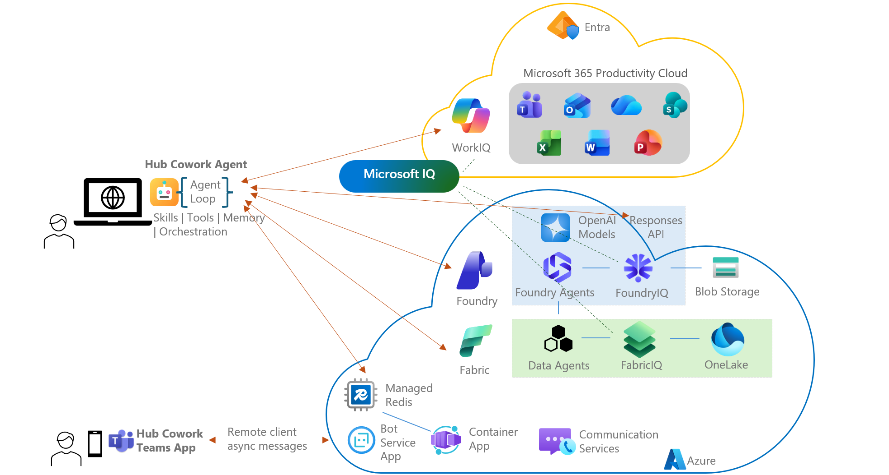

# Hub Cowork

> A local-first, single-user **Windows desktop AI agent** that runs an entire portfolio of Microsoft-stack workflows — engagement agendas, RFP intelligence briefs, meeting invites, retail price intelligence, M365 Q&A — through a unified **skills-based architecture** built on the **Azure OpenAI Responses API** and the **Model Context Protocol (MCP)**.
>
> Hub Cowork is intended as a **reference implementation** of the Anthropic [Claude Cowork](https://github.com/anthropics/knowledge-work-plugins) "skills + MCP" pattern, adapted to a Microsoft-cloud, single-Entra-identity, single-process desktop deployment.

---

## Table of contents

- [What it does](#what-it-does)
- [Solution architecture](#solution-architecture)
- [Why it exists — the design pattern](#why-it-exists--the-design-pattern)
- [The three layers](#the-three-layers)
- [Runtime architecture](#runtime-architecture)
- [Built-in skills](#built-in-skills)
- [The two clouds — M365 + Azure](#the-two-clouds--m365--azure)
- [Per-conversation concurrency](#per-conversation-concurrency)
- [Teams remote access (optional)](#teams-remote-access-optional)
- [Authentication](#authentication)
- [Configuration & Settings UI](#configuration--settings-ui)
- [Project structure](#project-structure)
- [Getting started](#getting-started)
- [WebSocket protocol](#websocket-protocol)
- [Service status monitor](#service-status-monitor)
- [Adding a skill or a tool](#adding-a-skill-or-a-tool)
- [Design docs](#design-docs)

---

## What it does

Hub Cowork is the daily driver of a Microsoft Innovation Hub Solution Engineer. From a single chat window (or from Microsoft Teams when you're away from your desk), the agent:

- Builds a **customer engagement agenda** end-to-end — finds the briefing call in your Outlook calendar, reads the meeting notes, classifies the engagement type (ADS, Hackathon, Business / Solution Envisioning, …), constructs a detailed agenda table with timings and speakers, and publishes it as a Word document into your OneDrive.
- Repurposes an existing agenda for a new customer.
- Sends **calendar invites** to the speakers on a published agenda.
- Compiles a **Bid Intelligence Brief** for an inbound RFP — pulls the RFP from your inbox, queries FoundryIQ (Azure AI Search over past customer testimonials), queries the Fabric Data Agent (Lakehouse-backed structured project data), synthesises the brief, saves it to OneDrive, and shares it with the team.
- Runs a **shelf-watch** — drives a real Chromium browser via Azure OpenAI's Computer-Use model to extract competitor pricing for SKUs across multiple retail websites, then compares against your last run.
- Answers **conversational Q&A** about any of your M365 data via WorkIQ.
- Reports **task status** instantly — even while a long-running task is in flight.

Everything runs on the user's laptop, under the user's Entra identity, with one sign-in.

---

## Solution architecture



The diagram shows every moving piece in one frame — the desktop app on the left, the user's identity in the middle, and the Azure / Microsoft 365 services the agent reaches into on the right. The narration below walks the diagram in the order data flows through it.

### The desktop app

Hub Cowork ships as a **single-process Windows desktop application** (`python -m hub_cowork`, packaged as `pythonw.exe` for production so there is no console window). The UI is a [pywebview](https://pywebview.flowrl.com/) window hosting an embedded **Microsoft Edge WebView2** control that renders the chat UI (a single-file vanilla HTML/CSS/JS app under `src/hub_cowork/assets/chat_ui.html`). UI ↔ backend traffic is a local WebSocket on `ws://localhost:18080`; a Win32 system tray (raw ctypes) keeps the app reachable when the window is minimised. From the user's perspective it is one app to launch, one window to look at, one tray icon to right-click.

### Identity — one Microsoft Entra sign-in for everything

The user signs in **once**, via the Settings UI, against **Microsoft Entra ID**. The credential is built by `core/auth_credential.py`, which prefers the **WAM broker** (`InteractiveBrowserBrokerCredential` from `azure-identity-broker`) parented to the WebView2 HWND so the account picker is modal to our window; it falls back to classic `InteractiveBrowserCredential` when the broker is unavailable. The resulting MSAL token cache is persisted to `~/.hub-cowork/` and is **shared across the host process and every MCP server subprocess**. Tools never receive tokens as arguments; they call `get_credential()` themselves and the on-disk cache lets the subprocess silently mint scope-specific tokens (Graph, Azure OpenAI, FoundryIQ, Fabric, ACS, Teams Bot, …) from the same refresh token the host wrote at sign-in. **One identity, one sign-in, every service.**

### The agent loop — Azure OpenAI Responses API as orchestrator

The primary agent is the **Azure OpenAI Responses API**, called from the Hub Cowork desktop app. The desktop process runs the canonical Responses-API tool-execution loop (§14.1 of [`SKILLS_DESIGN_PRINCIPLES.md`](docs/architecture/SKILLS_DESIGN_PRINCIPLES.md)) — it sends the skill's `SKILL.md` as instructions and the skill's tool catalog, then handles `requires_action` events by dispatching tool calls and submitting their outputs back to the API. The model decides *what* to do; the desktop is just the bridge.

**Tools are MCP servers.** A host-scoped `MCPClientPool` lazy-spawns each MCP server as a **stdio subprocess** on first use (per-skill servers under `src/hub_cowork/skills/<skill>/mcp_server/`, shared servers under `src/hub_cowork/mcp_servers/`) and keeps them warm for the host's lifetime. Calls are multiplexed across all conversation threads — never one-subprocess-per-call.

Because stdio MCP servers run on the user's machine and are unreachable from Azure, they cannot be passed to the Responses API as native `mcp` tools (that mode only accepts remote HTTP URLs). Instead, at skill-start the host calls MCP `tools/list` on every server the skill connects to and registers each tool with the Responses API as an ordinary **`type="function"` function call**. When the model emits a tool call, the agent loop dispatches it through the pool into the right warm subprocess and submits the JSON result back. The model never knows MCP is on the wire — from its perspective everything is a function call.

**Cloud-hosted MCP servers, when present, can be invoked directly by the Responses API** (declared in `skill.yaml` as `transport: streamable_http` with a URL, registered as `{type: "mcp", server_url: ...}`); the model server then makes the call cloud-to-cloud and we never see the bytes. **In the current scope of the agent app every tool call is locally executed** — no MCP server is registered as a native Responses-API `mcp` tool yet. The plumbing for the swap is in place (§11.4a, §11.7); flipping a server is a one-line change in `skill.yaml`.

### What each tool reaches into

- **WorkIQ CLI (`workiq.exe`).** A large fraction of the M365-facing tool calls go through the **Microsoft WorkIQ command-line binary** — a single call into the WorkIQ intelligence layer that spans **Microsoft 365 Copilot's view of Teams, Outlook, SharePoint, OneDrive and the Microsoft Graph**. One call, one identity, one answer that already joins across the silos. The local MCP `workiq` server wraps this binary; tools like `query_workiq` and `resolve_speakers` are thin shells over it.
- **FoundryIQ.** Reached via the **MCP endpoints FoundryIQ exposes**. Today the `search_foundryiq` tool runs in a local MCP server that *forwards* the call to the cloud MCP endpoint — a redundant local-MCP → cloud-MCP hop that exists only because we still client-dispatch every tool. **In the next version of the agent app this call will be made entirely Azure-executed** by registering FoundryIQ's MCP server natively with the Responses API, removing our local proxy hop.
- **Fabric Data Agent.** Exposes an **Azure OpenAI Assistants API** endpoint backed by a Microsoft Fabric Data Agent over the Lakehouse with structured project history. The `query_fabric_agent` tool is an Assistants-API client — it creates a thread, posts the question, polls for the run, and returns the structured answer.
- **Azure Communication Services (ACS).** Used by the **`send_email` / meeting-invite tool** to deliver `.ics` calendar invitations to the speakers on a published Innovation Hub agenda. ACS handles the SMTP-layer sending under our verified sender domain.
- **Azure Blob Storage.** Holds the corpus of **case studies and customer testimonial PDF documents** that FoundryIQ indexes directly. The agent never reads blobs itself — it queries the FoundryIQ index, which already has the documents ingested.

### The local file system — documents written locally, OneDrive syncs them to the cloud

The desktop app has access to the **user's local folders**, and that is the deliberate channel for every artefact the agent produces. When a tool emits a Word document — the engagement agenda from `engagement_agenda`, the repurposed agenda from `agenda_repurpose`, the Bid Intelligence Brief from `rfp_evaluation`, the price-comparison report from `shelf_watch` — it is written to a configured local folder (`agenda_output_folder` / `RFP_OUTPUT_FOLDER` in hub config; defaults under `~/Documents/hub-cowork-agenda-docs/` and `~/Documents/hub-cowork-rfp-docs/`). The user is expected to point those folders at a path **already enrolled in the OneDrive sync client**, so the file appears in the cloud automatically a few seconds after it is written. The agent does not call the Graph upload API for these artefacts; it relies on the OS-level OneDrive client the user already trusts. Sharing links and "open in browser" URLs are then resolved against the synced cloud copy.

The same local-first pattern covers everything Hub Cowork persists outside the Responses API: the per-thread JSON files in `~/.hub-cowork/threads/`, the MSAL token cache, the hub-config overrides, the `shelf_watch` run history. It's the user's machine, the user's filesystem, the user's identity — nothing intermediated by a managed service we own.

### Remote access via Microsoft Teams

The user does not have to be in front of their laptop to drive the agent. **Azure Managed Redis** holds the inbound and outbound user-message streams (`{ns}:inbox:{email}`, `{ns}:outbox:{email}`, plus a presence key with TTL heartbeat). It is the **integration channel between the agent app and any client surface that Azure Bot Service supports** — today that means the **Microsoft Teams app**, but the same channel works for other Bot-Service-backed clients without changing the agent.

The Teams side is an **Azure Bot Service app + a Microsoft Teams app manifest** wired to a small relay (`workiq-agent-remote-client`) hosted in **Azure Container Apps**. The relay translates Teams activities into Redis inbox writes and reads outbox messages back into Teams replies, with `#thread-xxxx` correlation tags so HITL follow-ups route to the right conversation. The desktop app's `host/redis_bridge.py` polls the inbox, classifies each message (`new` / `existing` / `system`), enforces a per-Teams-user in-flight gate for new threads, and writes outbox replies. **Net effect: a long-running task can be kicked off from Teams on the train, run on the user's machine, and reply back to Teams — the user does not need to be at their computer.**

### Microsoft Foundry

**Microsoft Foundry is not used as an agent platform here.** Its only role in the architecture today is **hosting the Azure OpenAI Responses API** that drives the agent loop. We deliberately keep orchestration in our process so we can do per-skill model-tier routing (§18.3), per-skill tool scoping (§18.2), and HITL as a thread-status flag rather than a Foundry-managed state.

### Two clouds, one identity

Everything above resolves to two clouds and one identity:

- **Microsoft 365** — reached via WorkIQ CLI (Teams, Outlook, SharePoint, OneDrive, Graph) and via direct Graph calls for things like calendar invite delivery confirmation.
- **Azure** — Azure OpenAI (Responses API + Computer-Use), FoundryIQ, Fabric Data Agent (Assistants API), ACS, Azure Blob Storage, Azure Managed Redis, Azure Bot Service, Azure Container Apps.
- **One Microsoft Entra identity** signs into both. No second OAuth dance, no per-tool token store, no token-routing gateway.

---

## Why it exists — the design pattern

Production AI agents that try to encode workflow logic in one giant system prompt collapse under their own weight: the prompt grows past 5–10K tokens, every change risks a regression, the model starts hallucinating procedure, and human-in-the-loop turns devolve into brittle marker-string state machines (`[AWAITING_CONFIRMATION]`, `[STOP_CHAIN]`, …).

Anthropic's [Claude Cowork](https://github.com/anthropics/knowledge-work-plugins) fixed this with a clean three-layer split: the **model** orchestrates, **skills** carry domain expertise, **tools** do mechanical work. Hub Cowork is the same pattern, ported to:

- **Azure OpenAI** (Responses API) instead of Anthropic Claude
- **One shared Microsoft Entra identity** instead of per-tool OAuth
- **Local Python MCP servers** spawned by the host, calling Microsoft cloud services on the user's behalf (instead of cloud-resident MCP services)

The full charter is in [docs/architecture/SKILLS_DESIGN_PRINCIPLES.md](docs/architecture/SKILLS_DESIGN_PRINCIPLES.md). The 14 non-negotiables there are binding for every skill, tool, and runtime change in this repo. The condensed version follows.

---

## The three layers

| Layer | Owns | Lives in | What it must NOT do |
|---|---|---|---|
| **Model** (Azure OpenAI Responses API) | Tool selection, sequencing, conversation, HITL turns, error communication | The Responses API server-side loop | — |
| **Skill** (`SKILL.md`) | Domain expertise — when/why/what-if judgment, engagement-type heuristics, communication tone | `src/hub_cowork/skills/<name>/SKILL.md` | Numbered runbooks, string-formatting recipes, control-flow markers, anything that could be a Python function |
| **Tool** (`@mcp.tool`) | Mechanical work — fetch, parse, transform, write | An MCP server module under `mcp_servers/<name>/tools/` or `skills/<name>/mcp_server/tools/` | Decide what to tell the user, call other tools, construct credentials, hardcode user-facing prose |
| **Memory & state** (`ConversationThread` + `previous_response_id`) | Resumable per-conversation state — what the model already knows, what stage the workflow is in, whether the thread is parked waiting for the user | `~/.hub-cowork/threads/{active,archive}/<id>.json` (locally) + Azure OpenAI's server-side response chain (cloud) | Mirror the model's history into a parallel `messages` list, hold per-skill scratchpads, or stuff inter-phase state into on-disk JSON |

### How memory works (and why there's no separate "memory store")

Hub Cowork follows the Cowork principle that conversation state belongs to the model, not the runtime. The full history of every turn — user messages, tool calls, tool results, model reasoning — is held **server-side by the Responses API**, keyed off `previous_response_id`. Locally we persist only enough to resume:

- `previous_response_id` — the pointer the API uses to reconstruct the conversation on the next turn.
- `status` — `running` / `awaiting_user` / `completed` / `failed` / `archived`.
- Lightweight UI metadata (`progress_log`, `code_log`) — write-only side channels, never fed back into the LLM context.

When the model ends a turn with a question, `agent_core` flips the thread to `awaiting_user` and the executor worker exits. The thread sits parked — on disk, with its `previous_response_id` — indefinitely. The user can answer in five seconds, an hour later from Teams, or the next morning after a laptop reboot. As soon as the reply arrives, a fresh `_ThreadWorker` calls the Responses API with the same `previous_response_id` and the model **picks up exactly where it left off, with the full prior context already in scope**. There is no replay, no transcript reconstruction, no skill-side memory shuffling.

A few corollaries fall out of this:

- **The host can restart mid-conversation.** Active threads on disk reload at boot; their `previous_response_id` still resolves at Azure (response chains live ~30 days). The user notices nothing.
- **No tool ever "remembers" anything across calls.** Tools are stateless and return facts; if a later tool needs context from an earlier one, the model fishes it out of the conversation history when it composes the next call's arguments.
- **Skills don't carry inter-phase scratchpads.** A multi-phase workflow like `engagement_agenda` flows phase → phase via `previous_response_id`; there is no `engagement_context.json` handoff file between phases, no shared dict, no per-skill cache.
- **One small carve-out for run-over-run memory.** `shelf_watch` is the one skill that genuinely needs *cross-conversation* memory — "what were the prices last week?" That is stored as a small per-run JSON snapshot under `<agenda_output_folder>/shelf-watch/runs/` plus a rolling `history.json`, owned by the skill's tools. It's the exception that proves the rule: the moment a workflow needs to remember something that outlives a conversation, the answer is a tool that reads/writes a file the user owns — not a runtime memory subsystem.

The runtime in `core/agent_core.py` is **wiring, not intelligence**. It does not parse model output for control-flow markers. It does not chain skills. It does not interpret tool results. The canonical loop is exactly:

```python
while response.status == "requires_action":
    for tc in response.required_action.submit_tool_outputs.tool_calls:
        result = mcp_pool.call(server, tc.function.name, json.loads(tc.function.arguments),
                               on_progress=on_progress)
        outputs.append({"tool_call_id": tc.id, "output": result})
    response = client.responses.submit_tool_outputs(response_id=response.id,
                                                    tool_outputs=outputs)
```

That's it. ~30 lines. Everything else (skill discovery, model-tier routing, conversation persistence, HITL pause/resume, Teams bridging, UI broadcast) sits *around* this loop, never *inside* it.

### What this buys us

- **Adding a new workflow = drop in a folder.** A skill is `skill.yaml` + `SKILL.md` (+ optional `mcp_server/`). No registration, no manifest, no decorator.
- **Workflows stay single-skill.** A multi-phase workflow like `engagement_agenda` is one skill with a richer tool set; `previous_response_id` carries phase-to-phase context across turns. There is no skill chaining, no `next_skill`, no on-disk inter-phase store.
- **HITL is a conversation turn.** The model asks a question; the runtime sees a final text response with no pending tool calls and parks the thread at `awaiting_user`; the next message resumes via `previous_response_id`. No markers in instructions, no marker parsing in `agent_core`.
- **Tool composition is the model's job.** Tools never call other tools. The model orchestrates.

---

## Runtime architecture

```
┌─────────────────────────────────────────────────────────────────────────────┐
│                          Windows 11 desktop (one process)                   │
│                                                                             │
│  pywebview window  ◄── WebSocket ──►  desktop_host.py                       │
│  (chat_ui.html)        (port 18080)   • WS server + HTTP server (18081)     │
│                                       • System tray (Win32 ctypes)          │
│                                       • Optional Redis bridge               │
│                                            │                                │
│                                       ┌────▼─────┐                          │
│                                       │ Thread   │  one ConversationThread  │
│                                       │ Manager  │  per chat tab            │
│                                       └────┬─────┘                          │
│                                            │                                │
│                                       ┌────▼──────┐                         │
│                                       │ Executor  │  one daemon worker per  │
│                                       │ Pool      │  active thread          │
│                                       └────┬──────┘                         │
│                                            │                                │
│              ┌─────────────────────────────▼──────────────────────────┐     │
│              │             agent_core.run_agent_on_thread             │     │
│              │  1. Router (fast model)  →  pick skill or "none"       │     │
│              │  2. Load SKILL.md + skill.yaml                         │     │
│              │  3. List MCP tools from each server in skill.yaml      │     │
│              │  4. responses.create(...) with function-tool schemas   │     │
│              │  5. while requires_action: dispatch into MCPClientPool │     │
│              │  6. Persist previous_response_id on the thread         │     │
│              └────────────┬───────────────────────────────────────────┘     │
│                           │                                                 │
│                ┌──────────▼─────────────┐                                   │
│                │     MCPClientPool      │  one warm stdio subprocess        │
│                │  (host-scoped, lazy)   │  per server, multiplexed          │
│                └─────────┬──────────────┘  across all conversation threads  │
│                          │                                                  │
│         ┌────────────────┼────────────────────────────────────┐             │
│         ▼                ▼                ▼                   ▼             │
│   ┌──────────┐    ┌────────────┐   ┌────────────┐   ┌──────────────────┐    │
│   │ workiq   │    │   m365     │   │ utility    │   │ per-skill server │    │
│   │ MCP srv  │    │  MCP srv   │   │  MCP srv   │   │ (e.g. rfp_eval/  │    │
│   │ (shared) │    │  (shared)  │   │  (shared)  │   │  mcp_server/)    │    │
│   └────┬─────┘    └─────┬──────┘   └──────┬─────┘   └──────┬───────────┘    │
└────────┼────────────────┼─────────────────┼────────────────┼────────────────┘
         │                │                 │                │
         ▼                ▼                 ▼                ▼
   WorkIQ CLI        Graph + ACS        in-process    FoundryIQ + Fabric
   (M365 data)       (mail / docs)      utilities     (RFP knowledge)
```

### What sits where

| Component | Module | Role |
|---|---|---|
| Agent core | [`core/agent_core.py`](src/hub_cowork/core/agent_core.py) | Router, skill loader, `MCPClientPool` registration, the `requires_action` execution loop |
| MCP client pool | [`core/mcp_client_pool.py`](src/hub_cowork/core/mcp_client_pool.py) | Lazy spawn of MCP server subprocesses, multiplexed calls, progress-notification forwarding |
| MCP server runtime | [`mcp_servers/_runtime.py`](src/hub_cowork/mcp_servers/_runtime.py) | Shared stdio MCP server entrypoint used by every server module |
| Auth | [`core/auth_credential.py`](src/hub_cowork/core/auth_credential.py) | WAM-broker-first single Entra credential, parented to the pywebview HWND |
| Conversation state | [`core/conversation_thread.py`](src/hub_cowork/core/conversation_thread.py) | The `ConversationThread` dataclass — `previous_response_id`, status, progress/code logs, source, HITL correlation tag |
| Thread registry | [`core/thread_manager.py`](src/hub_cowork/core/thread_manager.py) | Thread-safe registry, observer pattern, `current_thread_id` ContextVar |
| Executor pool | [`core/thread_executor.py`](src/hub_cowork/core/thread_executor.py) | One daemon worker per active conversation, idle-shutdown |
| Persistence | [`core/thread_store.py`](src/hub_cowork/core/thread_store.py) | `LocalJsonThreadStore` with debounced atomic writes |
| Hub config | [`core/hub_config.py`](src/hub_cowork/core/hub_config.py) | Defaults ⊕ user overrides + `_env_overrides` env editor support |
| Service status | [`core/service_status.py`](src/hub_cowork/core/service_status.py) | Per-service reachability, passive + active probes |
| Computer-Use harness | [`core/computer_use.py`](src/hub_cowork/core/computer_use.py) | Generic Azure OpenAI gpt-5.4 + Playwright Chromium loop (used by `shelf_watch`) |
| Desktop host | [`host/desktop_host.py`](src/hub_cowork/host/desktop_host.py) | WS + HTTP servers, pywebview window, tray, Redis bridge wiring |
| Console host | [`host/console.py`](src/hub_cowork/host/console.py) | Terminal REPL — same agent core, no UI, no Redis bridge |
| Redis bridge | [`host/redis_bridge.py`](src/hub_cowork/host/redis_bridge.py) | Teams remote-message inbox/outbox, classifier, per-user gate, `#thread-xxxx` correlation |

---

## Runtime internals

The deeper mechanics — how MCP is wired on the wire, the full process and thread map, lifecycles, and memory footprint — live in [`docs/architecture/RUNTIME_INTERNALS.md`](docs/architecture/RUNTIME_INTERNALS.md). The two facts most worth carrying in your head:

- **Stdio MCP servers are not native Responses-API `mcp` tools.** Each MCP tool is registered as an ordinary `type="function"` tool built from the server's `tools/list` advertisement; the agent loop dispatches `requires_action` calls into `MCPClientPool`. The Responses API's native `mcp` tool type accepts only remote URLs, which we'll use once a server moves to ACA.
- **The pool is host-scoped, not thread-scoped.** One warm subprocess per server name, multiplexed across every conversation thread. Never one-subprocess-per-call.

Auth crosses the host ↔ subprocess boundary via the shared on-disk MSAL cache at `~/.hub-cowork/`, not over the MCP transport — every server calls `get_credential()` itself.

---

## Built-in skills

Each skill is a folder under `src/hub_cowork/skills/` containing `skill.yaml` (config) + `SKILL.md` (system prompt) + optional `mcp_server/` (skill-local tools).

| Skill | Tier | Queued | What it does |
|---|---|---|---|
| **`engagement_agenda`** | reasoning | yes | Single-skill, multi-phase workflow. Finds briefing calls, confirms with user (HITL), reads meeting notes, classifies engagement type, builds a detailed agenda table, publishes to Word in OneDrive. |
| **`agenda_repurpose`** | reasoning | yes | Retrieve an existing agenda, collect new customer details, produce a repurposed Word document. |
| **`meeting_invites`** | reasoning | yes | From a published agenda, filter speakers, resolve their emails, send calendar invites via ACS. |
| **`rfp_evaluation`** | reasoning | yes | Pull an RFP from email, parallel-fan-out to FoundryIQ (testimonials) and Fabric Data Agent (structured project history), synthesise a Bid Intelligence Brief, save to OneDrive, share with the team. |
| **`shelf_watch`** | reasoning | yes | Single-tool computer-use workflow. SKU plausibility check → discovery sweep across retailers (vision-LLM triage of result pages) → variant disambiguation HITL → deep scrape of confirmed PDPs → Word report with vs-Last-Run delta. |
| **`qa`** | fast | yes | Conversational Q&A about M365 data with per-thread history. |
| **`task_status`** | fast | no | Reports current thread progress and active-thread count — runs on the SYSTEM pseudo-thread so it answers instantly even while a real task is in flight. |
| *(router direct)* | fast | no | Greetings and small talk — classified as `"none"` and answered by the router itself. No skill is invoked. |

**Queued** = serializes on the conversation's own executor thread. Non-queued skills run on the SYSTEM pseudo-thread immediately.

### Where each skill's tools live

```
src/hub_cowork/
├── mcp_servers/                    # shared MCP servers (used by ≥2 skills)
│   ├── workiq/                     # query_workiq
│   ├── m365/                       # send_email, create_word_doc, resolve_speakers
│   ├── utility/                    # log_progress, get_hub_config, get_task_status
│   ├── _runtime.py                 # the actual MCP wire-protocol layer
│   └── _tool_result.py             # standard result envelope
└── skills/
    ├── engagement_agenda/          # tools live in shared servers — no local mcp_server
    ├── agenda_repurpose/
    ├── meeting_invites/
    │   └── mcp_server/tools/       # create_meeting_invites
    ├── rfp_evaluation/
    │   └── mcp_server/tools/       # search_foundryiq, query_fabric_agent,
    │                               # create_rfp_brief_doc, share_onedrive_document,
    │                               # create_calendar_reminder
    ├── shelf_watch/
    │   └── mcp_server/tools/       # shelf_watch_run + private _compare/_discover/_memory/_report/_session
    ├── qa/
    └── task_status/
```

---

## The two clouds — M365 + Azure

Hub Cowork bridges two Microsoft clouds with the user's **Microsoft Entra** identity flowing on-behalf-of across both:

**Microsoft 365 cloud — the user's work intelligence**

- **WorkIQ** runs as a CLI on the local computer and is the backbone of the user's identity for everything that follows. Once the user signs in (WAM broker, persistent token cache), the same Entra credential is shared with Azure OpenAI, ACS, Redis, FoundryIQ, Fabric, and every MCP server subprocess.
- Through WorkIQ, the agent reads the user's calendars, emails, OneDrive, SharePoint, and contacts with their own permissions.

**Azure cloud — reasoning, knowledge, and structured insight**

- **Azure OpenAI Responses API** — the autonomous reasoning core that orchestrates the multi-step agent loop via function calling. Two model deployments: a reasoning model (e.g. `gpt-5.2`) and a fast model (e.g. `gpt-5.4-mini`).
- **FoundryIQ** — Agentic RAG over customer testimonials from past engagements (Azure Blob Storage → Azure AI Search). Used by the RFP skill.
- **Fabric Data Agent** — natural-language interface over OneLake-resident structured project data (risks, costs, timelines, KPIs). Called directly via its OpenAI-compatible Assistants endpoint with a Fabric-scoped Entra bearer token.
- **Azure Communication Services** — calendar invite email, used by `meeting_invites`.
- **Azure Managed Redis (cluster mode, optional)** — Teams remote-message inbox/outbox bridge. Passwordless Entra ID via `redis-entraid` credential provider.

The user's Entra token issued at sign-in is propagated on-behalf-of to all of the above. The agent never holds a shared service principal.

---

## Per-conversation concurrency

Hub Cowork is single-process but multi-threaded. Every chat tab is its own `ConversationThread` with its own Responses-API context (its own `previous_response_id`). You can be running an RFP brief in tab A while asking a Q&A question in tab B — they execute in parallel.

| Layer | What happens |
|---|---|
| `ThreadManager` | Thread-safe registry of `ConversationThread` objects. Observer pattern for UI broadcast. Owns the `current_thread_id` `ContextVar` so logs and progress events route to the correct chat panel. |
| `ExecutorPool` | One daemon `_ThreadWorker` per active conversation. Workers idle-shut-down after a configurable interval. Each worker sets `current_thread_id` before dispatching. |
| `LocalJsonThreadStore` | Debounced atomic writes under `~/.hub-cowork/threads/{active,archive}/`. Threads survive restart and resume from `previous_response_id`. |
| `MCPClientPool` | **Host-scoped, not thread-scoped.** One subprocess per server name, multiplexed across all conversation threads. |

A SYSTEM pseudo-thread (`thread_id == "system"`) handles cross-task questions ("what threads do I have running?"). It is never persisted and never accumulates `previous_response_id` — every system query is one-shot. This is why `task_status` can answer instantly even while a real task is in flight.

---

## Teams remote access (optional)

When `AZ_REDIS_CACHE_ENDPOINT` is set, a separate **Azure Container App** ([workiq-agent-remote-client](https://github.com/sansri/workiq-agent-remote-client), built on the **Microsoft 365 Agents SDK** and fronting an **Azure Bot Service** channel) bridges Microsoft Teams to the agent via Azure Managed Redis streams.

The user fires off a workflow from Teams on their phone, closes the laptop lid, and gets the result back asynchronously when the workflow completes — because the local agent runs autonomously in the system tray.

Three mechanisms keep multi-thread remote traffic predictable:

1. **Inbox classifier** (`agent_core.classify_inbox`) — every inbound Teams message is classified `new`, `existing`, or `system`. Strong signals bias toward `existing` when the user is replying to a multi-field question, numbered options, or a yes/no confirmation. Fast-path: if the relay supplies a `thread_id` hint extracted from the `#thread-xxxx` correlation tag, the classifier verdict for that thread is honored without an LLM call.
2. **Per-Teams-user gate** — for `new` classifications only, if the same Teams user already has an in-flight thread (`running` or `awaiting_user`, `source=="remote"`), the new thread is rejected with an outbox message tagged to the blocking thread's correlation. `existing` and `system` bypass the gate so HITL replies and status checks are never blocked.
3. **`#thread-xxxx` correlation tags** — every outbound Teams reply is prefixed with the thread's `hitl_correlation_tag`. Users keep the tag in their Teams reply to deterministically route follow-ups; the relay strips the tag from user-visible text and forwards it as a structured hint.

Redis keys are namespaced by `REDIS_NAMESPACE` (default `hub-cowork`) so multiple Hub Cowork forks/deployments can share one Redis cluster without colliding.

---

## Authentication

Hub Cowork is a **multi-tenant** desktop agent: it talks to Azure OpenAI / ACS / WorkIQ in the user's home tenant (`AZURE_TENANT_ID`) and to FoundryIQ + Fabric Data Agent in a separate resource tenant (`RESOURCE_TENANT_ID`) where the user is a guest. To make this look and feel native — and silent on every restart — the auth stack is:

1. **WAM (Windows Account Manager) broker** via [`azure-identity-broker`](https://pypi.org/project/azure-identity-broker/) — the same native account picker Teams, Outlook, and Office show. **No browser opens.** The pywebview HWND is registered with `set_parent_window_handle()` so the picker is modal to our UI.
2. **Classic `InteractiveBrowserCredential` fallback** when `pymsalruntime` is missing (macOS / Linux / older Windows).
3. **`AuthenticationRecord` persisted to disk** for silent token refresh across restarts.
4. **One credential, shared everywhere.** Built once in `agent_core` startup; published via `set_credential()`; consumed via `get_credential()` by the OpenAI client, `redis-entraid` provider, ACS sender, every MCP server subprocess (which reads the same on-disk MSAL cache), and the `outlook_helper`.
5. **No `DefaultAzureCredential`. No `az` CLI subprocesses** (we run under `pythonw.exe` — no console).

Sign-in is triggered from the Settings UI. The token blob is stored under the cache name `hub_cowork` so this fork doesn't fight a sibling fork over the same cached secret.

---

## Configuration & Settings UI

There are two distinct stores of settings:

### 1. Hub config (JSON) — application data

Things the agent reads as structured data via the `get_hub_config` tool: hub name, default session start time, topic catalog, agenda output folder, agenda template path, shelf-watch retailer registry.

```
src/hub_cowork/assets/hub_config.default.json   ← Shipped defaults
~/.hub-cowork/hub_config.json                   ← User overrides (created on first Save)

hub_config.load() returns:  defaults  ⊕  user overrides   (user wins per-key)
```

### 2. Environment variables — endpoints, model names, secrets

Three precedence layers, highest first:

| # | Source | Where it lives | Wins when |
|---|---|---|---|
| 1 | `_env_overrides` (Settings UI) | `~/.hub-cowork/hub_config.json` under `_env_overrides` | Always wins if set to a non-empty string |
| 2 | User `.env` file | CWD at launch | Wins over packaged defaults |
| 3 | Packaged `.env.defaults` | `src/hub_cowork/assets/.env.defaults` | Last-resort fallback |

[`__main__.py`](src/hub_cowork/__main__.py) promotes `_env_overrides` into `os.environ` *before* importing `agent_core`, then calls `load_dotenv(.env, override=False)` and `load_dotenv(assets/.env.defaults, override=False)`. `override=False` is the key — once a value is in `os.environ` it cannot be downgraded by a lower-precedence source.

**Net result:** there is exactly one source of truth per env var, computed at boot, regardless of which layer set it. The same merged view is visible to Python `os.environ` reads and to skill instructions via the `get_hub_config` tool (which flattens non-empty `_env_overrides` on top of the hub-config JSON before returning).

### Settings UI

The kebab (⋮) menu in the top-right opens **Settings**, **Restart agent**, **Skills**, and **About Hub Cowork**. The Settings modal has two sections:

- **Hub settings** — top-level keys in `hub_config.json` (hub name, session start time, speakers by topic, agenda/RFP output folders).
- **Environment variables** — every value typed here is saved to `_env_overrides` and applied on the next launch (the UI offers a one-click restart). Hub-config edits are picked up live by the next `get_hub_config` call.

### Required env vars

| Variable | Description |
|---|---|
| `AZURE_OPENAI_ENDPOINT` | Azure OpenAI resource endpoint |
| `AZURE_OPENAI_CHAT_MODEL` | Reasoning model deployment name |
| `AZURE_OPENAI_CHAT_MODEL_SMALL` | Fast model deployment name |
| `AZURE_OPENAI_API_VERSION` | e.g. `2025-03-01-preview` |
| `AZURE_TENANT_ID` | Home tenant ID for sign-in |
| `ACS_ENDPOINT`, `ACS_SENDER_ADDRESS` | Azure Communication Services (meeting invites) |

### Optional env vars

| Variable | Used by |
|---|---|
| `AZ_REDIS_CACHE_ENDPOINT`, `REDIS_NAMESPACE`, `REDIS_SESSION_TTL_SECONDS` | Teams remote bridge |
| `WORKIQ_PATH` | If WorkIQ CLI is not on `PATH` |
| `FOUNDRYIQ_*`, `FABRIC_DATA_AGENT_URL`, `FABRIC_AUTH_MODE`, `RESOURCE_TENANT_ID` | RFP skill |
| `RFP_OUTPUT_FOLDER`, `RFP_SHARE_RECIPIENTS` | RFP skill |
| `GRAPH_*` | Optional app-cred fallback for OneDrive sharing |
| `AGENT_TIMEZONE` | IANA TZ override (auto-detected otherwise) |

---

## Project structure

```
hub-cowork/
├── pyproject.toml
├── requirements.txt
├── README.md                            ← you are here
├── docs/
│   ├── architecture.png
│   ├── ui-architecture.md
│   └── architecture/
│       ├── SKILLS_DESIGN_PRINCIPLES.md  ← authoritative spec (the 14 non-negotiables)
│       ├── AUTHORING_A_SKILL.md         ← practical recipe for adding a skill
│       └── RUNTIME_INTERNALS.md         ← MCP wire mechanics, process/thread map, lifecycles
│
├── scripts/
│   ├── start.ps1     restart.ps1     stop.ps1
│   └── autostart.ps1
│
├── test-client/
│   └── chat.py                          ← console REPL that simulates a Teams relay
│
└── src/hub_cowork/
    ├── __main__.py                      ← `python -m hub_cowork` entry; applies env overrides
    │
    ├── core/                            ← runtime, no I/O wiring
    │   ├── agent_core.py
    │   ├── auth_credential.py
    │   ├── conversation_thread.py
    │   ├── thread_manager.py
    │   ├── thread_executor.py
    │   ├── thread_store.py
    │   ├── mcp_client_pool.py
    │   ├── hub_config.py
    │   ├── service_status.py
    │   ├── computer_use.py
    │   ├── outlook_helper.py
    │   └── app_paths.py
    │
    ├── host/                            ← runtime hosts
    │   ├── desktop_host.py              ← WS + HTTP servers, pywebview, tray, Redis wiring
    │   ├── console.py                   ← terminal REPL, no UI, no Redis
    │   ├── redis_bridge.py              ← Teams inbox/outbox + classifier + per-user gate
    │   ├── tray_icon.py                 ← Win32 ctypes tray with red-dot badge
    │   └── ui_actions.py
    │
    ├── mcp_servers/                     ← shared MCP servers (the actual MCP wire layer)
    │   ├── _runtime.py                  ← `serve(...)` — the lowlevel `mcp.server.Server`
    │   ├── _tool_result.py              ← standard envelope helpers
    │   ├── workiq/                      ← query_workiq
    │   ├── m365/                        ← send_email, create_word_doc, resolve_speakers
    │   └── utility/                     ← log_progress, get_hub_config, get_task_status
    │
    ├── skills/                          ← one folder per skill, auto-discovered
    │   ├── engagement_agenda/   skill.yaml + SKILL.md
    │   ├── agenda_repurpose/    skill.yaml + SKILL.md
    │   ├── meeting_invites/     skill.yaml + SKILL.md + mcp_server/
    │   ├── rfp_evaluation/      skill.yaml + SKILL.md + mcp_server/
    │   ├── shelf_watch/         skill.yaml + SKILL.md + mcp_server/
    │   ├── qa/                  skill.yaml + SKILL.md
    │   └── task_status/         skill.yaml + SKILL.md
    │
    └── assets/
        ├── chat_ui.html, chat_ui.css, chat_ui.js
        ├── hub_config.default.json
        └── .env.defaults
```

---

## Getting started

### Prerequisites

- **Windows 11** (Mac/Linux work for the core but tray + WAM are Windows-only)
- **Python 3.12+**
- **WorkIQ CLI** on `PATH` (or `WORKIQ_PATH` set)
- **Azure OpenAI** with a reasoning + fast model deployment
- **Azure Communication Services** (for meeting invites)
- **Azure Managed Redis** (optional — for Teams remote)

### Install

```powershell
git clone <repo-url>
cd hub-cowork

python -m venv .venv
.\.venv\Scripts\Activate.ps1
pip install -e .

copy .env.example .env
# Fill in Azure endpoints, model names, tenant id, ACS, optional Redis.
```

### Run

```powershell
# Headless (production) — no console window, runs under pythonw
.\scripts\start.ps1

# Stop / restart
.\scripts\stop.ps1
.\scripts\restart.ps1

# With console output (debug)
python -m hub_cowork

# Console REPL — same agent core, no UI, no Redis bridge
hub-cowork-console
```

`pip install -e .` registers two console scripts in `pyproject.toml`:

- `hub-cowork` — GUI launcher (no console window)
- `hub-cowork-console` — terminal REPL

### Auto-start at Windows login

```powershell
.\scripts\autostart.ps1 install
.\scripts\autostart.ps1 uninstall
```

---

## WebSocket protocol

All UI ↔ backend messages are JSON with a `type` field on `ws://localhost:18080`. Every invocation carries a `request_id` (`uuid.uuid4().hex[:8]`) used for correlation across WebSocket, UI, Redis outbox, and log entries.

**Client → server:** `create_thread`, `send_to_thread`, `cancel_thread`, `list_threads`, `get_thread`, `archive_thread`, `unarchive_thread`, `list_archived_threads`, `delete_thread`, `system_query`, `task`, `open_file`, `signin`, `clear_history`, `get_logs`, `get_config`, `save_config`, `validate_speakers`, `restart`.

**Server → client:** `threads_list`, `archived_threads_list`, `thread_created`, `thread_updated`, `thread_detail`, `thread_started`, `thread_progress`, `thread_completed`, `thread_error`, `thread_archived`, `thread_unarchived`, `thread_deleted`, `thread_unread`, `cancel_ack`, `log_entry`, `log_history`, `history_cleared`, `system_query_started`, `system_query_progress`, `system_query_complete`, `system_query_error`, `auth_status`, `signin_status`, `skills_list`, `service_status`, `config_data`, `config_saved`, `config_warning`, `restart_ack`, `progress`, `remote_message`, `error`.

### Redis streams (when Teams bridge is enabled)

| Key | Direction | Fields |
|---|---|---|
| `{ns}:inbox:{email}` | Remote → Agent | `sender`, `text`, `ts`, `msg_id`, optional `thread_id` hint |
| `{ns}:outbox:{email}` | Agent → Remote | `task_id`, `status`, `text` (prefixed with `#thread-xxxx`), `ts`, `in_reply_to` |
| `{ns}:agents:{email}` | Agent → Cloud | JSON: `{name, email, started_at, version}` with TTL refreshed every 30 min |

---

## Service status monitor

The top-bar pills (`MicrosoftIQ: WorkIQ • FoundryIQ • FabricIQ` and `Teams: Relay`) are driven by [`core/service_status.py`](src/hub_cowork/core/service_status.py), tracking reachability for the four external services with two update paths:

- **Passive — every tool call.** Tool result envelopes flow through `mark_from_envelope(...)`. `ok` / `no_data` → green; `error` with `kind=config` → grey; other errors → red.
- **Active — background probe thread.** Every 120s, services in `unknown` state or older than the interval are re-probed under a 6s budget. Probes never trigger interactive auth — they short-circuit to `unknown` until the user has signed in.

The Redis tile is updated directly by the bridge (it owns the connection and the presence-key TTL heartbeat) and is intentionally not in the active-probe rotation.

The Fabric probe is **token-acquisition only** — it doesn't make a real call to the Fabric Data Agent (which would spin up a Fabric thread + run and cost real compute). This is intentional but can false-positive in cross-tenant guest scenarios; if you ever see "FoundryIQ red, Fabric green, but actual Fabric calls fail", suspect a cross-tenant credential reuse problem.

---

## Adding a skill or a tool

The full recipe is in [docs/architecture/AUTHORING_A_SKILL.md](docs/architecture/AUTHORING_A_SKILL.md). The very short version:

### A new skill

```
src/hub_cowork/skills/<your_skill>/
├── skill.yaml      # config only — name, description, mcp_servers, tool_allowlist, model_tier, queued
├── SKILL.md        # the system prompt — domain expertise, NOT procedure
└── mcp_server/     # OPTIONAL — only if this skill needs new tools no other skill uses
    ├── __init__.py
    ├── __main__.py
    └── tools/
        └── <your_tool>.py
```

Restart. The skill is auto-discovered, indexed by the loader, included in the router prompt, and invokable. There is no registration, no manifest, no decorator.

**`skill.yaml` is config only.** No `instructions:`, no `next_skill:`, no `conversational:`, no prose. If you find yourself writing prose into YAML, you are doing it wrong — it goes in `SKILL.md`.

**`SKILL.md` carries judgment, not procedure.** A senior solution engineer should read it and nod. If it reads like a numbered runbook a robot follows, you are doing it wrong — push the procedural bits into a tool.

### A new tool

Pick the right server:

- **Skill-local** (used by one skill) → `skills/<skill>/mcp_server/tools/<tool>.py`
- **Shared** (used by ≥2 skills, or wraps a foundational service like WorkIQ / Graph / ACS) → `mcp_servers/<server>/tools/<tool>.py`

Don't preemptively share. Promote a tool to a shared server only when a second skill actually needs it.

Tool functions return **JSON-serializable structured facts** with a `status`/`found` discriminator. **Never user-facing prose.** Never call other tools (within or across servers — composition is the model's job). Never construct credentials — call `get_credential()` from inside the tool. Progress flows through MCP notifications, which the pool forwards to `on_progress`.

### The lint script

```powershell
python scripts/lint_skills.py
```

Run after any skill edit. The lint blocks the banned patterns (`instructions:` in YAML, `[STOP_CHAIN]` / `[AWAITING_CONFIRMATION]` markers, `next_skill:`, `conversational:`) and confirms each skill folder is well-formed.

---

## Design docs

| Document | Status | Purpose |
|---|---|---|
| [SKILLS_DESIGN_PRINCIPLES.md](docs/architecture/SKILLS_DESIGN_PRINCIPLES.md) | **Authoritative spec** | The 14 non-negotiables. The §9 PR checklist. Part I (the three layers), Part II (runtime mechanics), Part III (deliberate divergences from Cowork). Read this before authoring or modifying any skill, tool, or runtime change. |
| [AUTHORING_A_SKILL.md](docs/architecture/AUTHORING_A_SKILL.md) | Practical guide | The recipe — `skill.yaml` shape, `SKILL.md` style guide, MCP tool packaging, HITL pattern, validation. |
| [RUNTIME_INTERNALS.md](docs/architecture/RUNTIME_INTERNALS.md) | Runtime reference | MCP wire mechanics, full process and thread map, lifecycles, memory footprint. |
| [ui-architecture.md](docs/ui-architecture.md) | UI internals | Three-pane layout, breakpoint behaviour, in-chat step cards. |

### Reference

- [Anthropic knowledge-work-plugins](https://github.com/anthropics/knowledge-work-plugins) — the original SKILL.md pattern and the Claude Cowork skills+MCP design Hub Cowork is modelled on.
- [Anthropic skills repo](https://github.com/anthropics/skills) — general-purpose skills.
- [Model Context Protocol spec](https://modelcontextprotocol.io/) and the [Python SDK](https://github.com/modelcontextprotocol/python-sdk) (`mcp` package).
- [Azure OpenAI Responses API](https://learn.microsoft.com/azure/ai-services/openai/concepts/responses) — the model orchestration layer.
- [`workiq-agent-remote-client`](https://github.com/sansri/workiq-agent-remote-client) — the Teams relay (Azure Container App on the Microsoft 365 Agents SDK).
